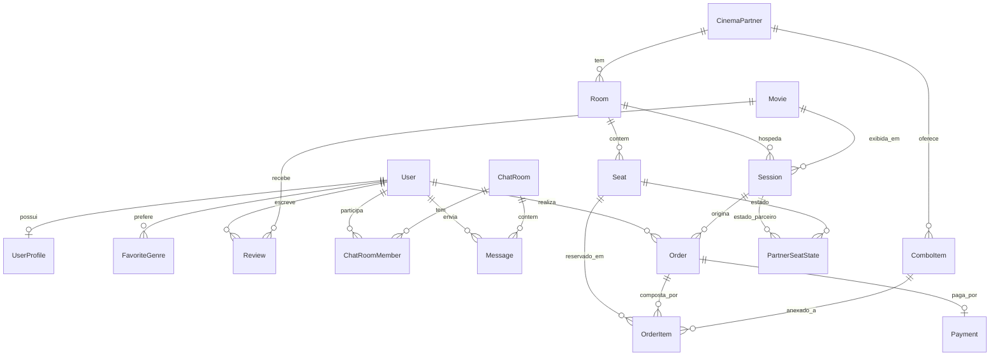

# CineVerse — Documentação Técnica do Backend
### Documento de apoio ao Trabalho de Conclusão de Curso

**Autor:** Guilherme Lopes Antunes
**Projeto:** CineVerse — plataforma social e de bilheteria para cinéfilos
**Artefato documentado:** backend (API REST + camada de tempo real)
**Data-base da análise:** 29/08/2026
**Repositório analisado:** `Cineverse/backend`

---

## Sumário

1. [Resumo do projeto](#1-resumo-do-projeto)
2. [O que o sistema faz](#2-o-que-o-sistema-faz)
3. [Escopo do MVP e delimitação](#3-escopo-do-mvp-e-delimitação)
4. [Requisitos e rastreabilidade](#4-requisitos-e-rastreabilidade)
5. [Metodologia de desenvolvimento](#5-metodologia-de-desenvolvimento)
6. [Tecnologias empregadas e justificativas](#6-tecnologias-empregadas-e-justificativas)
7. [Arquitetura do sistema](#7-arquitetura-do-sistema)
8. [Modelo de dados](#8-modelo-de-dados)
9. [Fluxos críticos detalhados](#9-fluxos-críticos-detalhados)
10. [Interface de programação (API)](#10-interface-de-programação-api)
11. [Segurança](#11-segurança)
12. [Estratégia e resultados de testes](#12-estratégia-e-resultados-de-testes)
13. [Integração contínua e ambiente de execução](#13-integração-contínua-e-ambiente-de-execução)
14. [Resultados obtidos](#14-resultados-obtidos)
15. [Dificuldades encontradas e soluções](#15-dificuldades-encontradas-e-soluções)
16. [Limitações e trabalhos futuros](#16-limitações-e-trabalhos-futuros)
17. [Glossário](#17-glossário)
18. [Referências](#18-referências)

---

## 1. Resumo do projeto

O **CineVerse** é uma aplicação B2C que unifica, em um único produto, duas experiências hoje fragmentadas para o público cinéfilo: (a) uma **rede social de cinema** — publicação de resenhas com nota, marcação de spoiler, compartilhamento externo e chat em tempo real — e (b) a **compra de ingressos hiperlocalizada** em um cinema parceiro, incluindo mapa de assentos em tempo real, checkout individual ou em grupo, combos de bomboniere e pagamento via Pix.

Este documento descreve exclusivamente o **backend** do sistema: uma API construída em Node.js/TypeScript sobre o framework NestJS, com PostgreSQL como banco transacional, Redis para locks distribuídos, cache e filas, e Socket.io para os canais de tempo real. O cliente móvel (Flutter) não faz parte do escopo aqui documentado.

**Justificativa do problema.** O usuário que quer decidir *o que assistir* e o usuário que quer *comprar o ingresso* são a mesma pessoa, mas hoje usam aplicativos diferentes: um agregador de críticas para descobrir, uma rede social para conversar, e o app da rede de cinema para comprar. O CineVerse propõe encurtar esse percurso, tratando descoberta social e transação como um único fluxo.

**Contribuição técnica central.** O ponto de maior complexidade — e o que o trabalho trata com mais rigor — é a **garantia de zero duplicidade na venda de assentos** sob concorrência real, resolvida com um lock atômico distribuído em Redis implementado via script Lua, comprovado por teste de concorrência com 20 tentativas simultâneas.

---

## 2. O que o sistema faz

O backend expõe onze módulos de domínio. A tabela abaixo descreve a funcionalidade entregue por cada um e seu estado de implementação verificado no código.

| Módulo | O que faz | Estado |
|---|---|---|
| `auth` | Cadastro de usuário com hash de senha (bcrypt), login com emissão de par *access token* (15 min) + *refresh token* (7 dias), com segredos criptográficos distintos | Implementado |
| `users` | Perfil do usuário e preferências de gênero cinematográfico (normalizadas em tabela própria), base para futura personalização de feed | Implementado |
| `catalog` | Sincronização periódica do catálogo de filmes em cartaz a partir da API pública do TMDB, via job assíncrono; listagem paginada servida do cache local | Implementado |
| `sessions` | Cadastro do cinema parceiro, salas, assentos e sessões de exibição; busca hiperlocal de sessões pelo cinema mais próximo às coordenadas do usuário; cadastro de combos de bomboniere | Implementado |
| `feed` | Publicação e listagem paginada de resenhas com nota de 1 a 5; ofuscação automática de conteúdo marcado como spoiler; revelação sob demanda; geração de metadados para compartilhamento externo | Implementado |
| `chat` | Salas de conversa individuais e em grupo, com persistência de histórico paginado e entrega de mensagens em tempo real via WebSocket | Implementado |
| `partner-integration` | Camada de abstração (*port*) sobre o sistema de bilheteria do cinema parceiro, com implementação simulada para o MVP | Implementado |
| `seats` | Mapa de assentos em tempo real combinando o estado do parceiro com os locks locais; reserva atômica tudo-ou-nada de N assentos; propagação de eventos de reserva, liberação e venda a todos os clientes conectados | Implementado |
| `orders` | Checkout em até três passos, com validação de que o comprador realmente detém o lock de cada assento; pedidos individuais e em grupo compartilham a mesma estrutura de dados; cálculo de total com combos por assento | Implementado |
| `payments` | Criação de cobrança Pix e recepção idempotente do webhook de confirmação do provedor | Implementado (Pix) |
| `health` | Verificação de liveness com checagem individualizada de PostgreSQL e Redis | Implementado |
| `tickets` | Geração e validação de QR Code assinado | **Não implementado** |
| `notifications` | Push de lembrete de sessão e promoções via FCM | **Não implementado** |
| `analytics` | Painel B2B com métricas agregadas e anonimizadas | **Não implementado** |

---

## 3. Escopo do MVP e delimitação

### 3.1 Dentro do escopo

- Um **único cinema parceiro piloto**. O modelo de dados não assume esse número (a entidade `CinemaPartner` é uma tabela real, não um singleton), mas nenhum requisito de múltiplos parceiros foi implementado.
- Integrações externas **simuladas** onde não há contraparte real disponível para um trabalho acadêmico (detalhado na seção 5.4).
- Backend apenas. O aplicativo Flutter, embora previsto na arquitetura do produto, não é objeto deste documento.

### 3.2 Explicitamente fora do escopo

Delimitação registrada no documento de requisitos e respeitada na implementação:

- Integração real com múltiplas redes de cinema (fase 2 do produto);
- Catraca de acesso 100% offline;
- Programa de fidelidade e gamificação;
- Motor de recomendação baseado em IA;
- Expansão internacional;
- Integração produtiva com API real de bilheteria de cinema.

---

## 4. Requisitos e rastreabilidade

O projeto parte de um **Documento de Levantamento de Requisitos** externo ao repositório, que numera requisitos funcionais (RF), não funcionais (RNF), regras de decisão (RD), restrições técnicas (RT) e casos de uso (CU). Cada task de implementação no backlog cita explicitamente sua origem, e o **critério de aceite do requisito é o critério de pronto da task** — não há definição de "pronto" paralela ou informal.

### 4.1 Matriz de rastreabilidade requisito → implementação

| Requisito | Descrição | Onde foi implementado |
|---|---|---|
| RF-01 | Cadastro e autenticação de usuário | `modules/auth` — `POST /auth/register`, `POST /auth/login` |
| RF-02 | Perfil e preferências de gênero | `modules/users` — `GET/PUT /users/me/profile` |
| RF-03 | Publicação de resenhas no feed | `modules/feed` — `POST/GET /reviews` |
| RF-04 | Marcação e ofuscação de spoiler | `FeedService.obfuscateIfSpoiler`, `GET /reviews/:id/reveal` |
| RF-05 | Chat em tempo real, individual e em grupo | `modules/chat` + namespace WebSocket `/chat` |
| RF-06 | Catálogo de filmes em cartaz | `modules/catalog` — job de sync + `GET /catalog/movies` |
| RF-07 | Busca hiperlocal de sessões | `GET /sessions/nearby` — cálculo de Haversine |
| RF-08 | Checkout individual em até 3 passos | `POST /sessions/:id/seats/lock` → `POST /orders` → `POST /orders/:id/payments` |
| RF-09 | Compra em grupo (múltiplos assentos) | Mesmo endpoint de checkout, N `OrderItem` por `Order` — **parcialmente concluído** (ver 16.1) |
| RF-10 | Mapa de assentos em tempo real | `modules/seats` + namespace WebSocket `/seats` |
| RF-11 | Pagamento via Pix | `modules/payments` — `PixProvider` / `MockPixProvider` |
| RF-12 | Pagamento via cartão | **Não implementado** |
| RF-13 / RF-14 | Geração e validação de QR Code | **Não implementado** |
| RF-15 | Combos (ingresso + bomboniere) | `ComboItem`, `GET /partners/:id/combos`, combo por assento |
| RF-16 | Compartilhamento externo de resenha | `GET /reviews/:id/share` |
| RF-17 | Notificações push | **Não implementado** |
| RNF-01 / RNF-07 | Escalabilidade horizontal sob pico | Aplicação *stateless* + Redis compartilhado + adapter Redis do Socket.io |
| RNF-04 | Monitoramento | `GET /health` (básico); monitoramento completo não implementado |
| RNF-06 | Payload reduzido no cliente | Paginação em todas as listagens; imagens servidas por URL da CDN do TMDB, sem proxy |
| RNF-08 | Zero duplicidade de venda de assento | `SeatLockService` — lock atômico Redis via script Lua |
| RNF-10 | Substituibilidade do parceiro | Interface `PartnerTicketingGateway` com injeção por token |
| RNF-12 | Validação de ingresso sob 500 ms | **Não implementado** |
| RD-02 | Sincronização do mapa de assentos | Eventos `seat_locked` / `seat_released` / `seat_sold` |
| RD-03 | Conformidade regulatória do Pix | Delegada ao provedor homologado — não implementada internamente |
| RT-02 | Uso da API do TMDB | `TmdbClient` com retry, timeout e dupla forma de autenticação |

### 4.2 Requisitos citados mas não detalhados na origem

O documento de requisitos original cita, em sua matriz de rastreabilidade, os identificadores **RF-18 a RF-21, RN-02, RN-06, RT-04 e CU-03** (painel B2B/backoffice, push segmentado por região) sem detalhá-los no corpo do texto. A arquitetura registra explicitamente essa lacuna, assume um módulo `analytics` como **inferência marcada** e recomenda validação com os stakeholders antes de tratá-los como requisito fechado. Essa honestidade de registro — separar o que foi levantado do que foi inferido — é ela própria uma decisão metodológica do trabalho.

---

## 5. Metodologia de desenvolvimento

### 5.1 Abordagem geral

O desenvolvimento seguiu um **processo iterativo e incremental orientado a backlog**, com características de metodologias ágeis, mas adaptado ao contexto de um trabalho individual de conclusão de curso (não há papéis de Scrum Master, Product Owner ou cerimônias de time).

Os elementos que caracterizam o processo:

**a) Backlog formal, faseado e rastreável.** O trabalho foi decomposto em **48 tasks numeradas (BE-01 a BE-48)**, agrupadas em **11 fases** que representam épicos funcionais:

| Fase | Tema | Tasks |
|---|---|---|
| 0 | Fundação (setup, banco, Redis, CI, erros e logging) | BE-01 a BE-05 |
| 1 | Identidade e perfil | BE-06 a BE-09 |
| 2 | Catálogo e busca | BE-10 a BE-14 |
| 3 | Social: feed e chat | BE-15 a BE-19 |
| 4 | Assentos e compra | BE-20 a BE-26 |
| 5 | Pagamentos | BE-27 a BE-31 |
| 6 | Ingressos e QR Code | BE-32 a BE-33 |
| 7 | Notificações | BE-34 a BE-36 |
| 8 | Painel B2B / analytics | BE-37 a BE-39 |
| 9 | Não funcionais transversais | BE-40 a BE-44 |
| 10 | Validação final (Definition of Done) | BE-45 a BE-48 |

**b) Ordenação por dependência técnica, não por valor percebido.** As fases obedecem à cadeia de dependências reais: não é possível travar um assento (fase 4) sem antes ter sessões cadastradas (fase 2), nem entregar tempo real (fases 3-4) sem a infraestrutura WebSocket. Essa ordenação é o que permite que cada task termine em um sistema funcionando, e não em uma peça isolada aguardando integração.

**c) Definition of Done por task.** Cada task carrega o critério de aceite do requisito de origem. A conclusão exige três coisas: (i) implementação, (ii) teste automatizado correspondente, (iii) atualização da documentação viva se alguma convenção mudou.

**d) Documentação viva versionada junto ao código.** Três documentos evoluem com o repositório:

- `ARQUITETURA_BACKEND.md` — traduz requisitos em decisões técnicas, com marcação explícita de `[inferência]` onde não havia informação nas entrevistas e de `[implementado, BE-XX]` onde a decisão virou código;
- `BACKLOG_BACKEND.md` — as 48 tasks, cada uma com origem e critério de aceite, atualizada com as decisões tomadas durante a implementação;
- `CLAUDE.md` — convenções de código e, sobretudo, um **registro de aprendizados técnicos** (armadilhas de biblioteca, comportamentos não documentados, decisões deliberadas), que funciona como memória institucional do projeto.

**e) Desenvolvimento assistido por IA.** O projeto foi conduzido com apoio de um assistente de programação (Claude Code) sob um protocolo explícito: uma task por vez, citada pelo identificador, seguindo a arquitetura documentada. Essa é uma característica metodológica relevante e digna de registro no TCC — não como automatização do raciocínio de projeto, mas como ferramenta de execução sob especificação humana. O próprio backlog inclui uma seção descrevendo esse protocolo de uso.

### 5.2 Verificação contínua

Nenhuma task é considerada concluída sem teste automatizado. O trabalho adota três níveis complementares de verificação:

1. **Testes unitários** com dublês (mocks) para isolar a lógica de serviço do banco e das dependências externas;
2. **Testes end-to-end** que sobem a aplicação real contra PostgreSQL e Redis reais, reservados para o que só se prova com infraestrutura verdadeira (concorrência, broadcast entre instâncias, integridade transacional);
3. **Validação manual ao vivo** de fluxos que envolvem múltiplos clientes simultâneos, com medição de latência registrada no backlog.

### 5.3 Integração contínua

Um pipeline de CI executa a cada *push* e *pull request*, na sequência: instalação determinística de dependências → verificação de lint → build → testes unitários → testes end-to-end. O pipeline provisiona um serviço Redis real, porque a suíte de WebSocket exige comunicação entre duas instâncias da aplicação — não é mockável.

### 5.4 Simulação de integrações externas (decisão metodológica)

Três integrações não têm contraparte real disponível para um trabalho acadêmico: o **ERP de bilheteria do cinema parceiro**, o **provedor de Pix homologado** e a **assinatura de webhook de pagamento**. A decisão metodológica foi **não fingir a integração, mas isolá-la atrás de uma interface**:

```
PartnerTicketingGateway (interface)  ←  MockPartnerGateway (implementação MVP)
PixProvider (interface)              ←  MockPixProvider (implementação MVP)
```

Isso aplica o **Princípio da Inversão de Dependência**: os módulos de alto nível (`seats`, `orders`, `payments`) dependem da abstração, nunca da implementação concreta, que é injetada por token no contêiner de dependências do NestJS. A consequência prática é que substituir o mock por um parceiro real não exige tocar em nenhum consumidor — exatamente o que o requisito RNF-10 pede.

Duas escolhas dentro dessa decisão merecem registro:

- O `MockPartnerGateway` **persiste seu estado em PostgreSQL**, não em memória de processo. Memória local funcionaria com uma instância e quebraria silenciosamente com várias — o oposto do que os requisitos de escalabilidade exigem.
- O `MockPixProvider` devolve um código "Copia e Cola" **deliberadamente falso**, que não tenta reproduzir o formato EMVCo/BR Code real. Reproduzir a especificação (codificação TLV, checksum CRC16) seria fabricar fielmente um formato que nenhum banco real leria — um token evidentemente falso é mais honesto sobre a natureza do artefato.

### 5.5 Rastreabilidade de decisões

Uma prática consistente ao longo de todo o código é o registro do **porquê** de decisões não óbvias em comentários, com referência à task e ao requisito de origem. Exemplos verificáveis no código: por que o lock usa Lua e não uma sequência de `SET NX`; por que o mock do parceiro não é seguro para concorrência *de propósito*; por que a comparação de senha roda mesmo quando o e-mail não existe. Para efeito de TCC, esses comentários constituem evidência documental das decisões de projeto.

---

## 6. Tecnologias empregadas e justificativas

### 6.1 Núcleo da aplicação

| Tecnologia | Versão | Papel | Justificativa técnica |
|---|---|---|---|
| **Node.js** | 24 LTS | Runtime | Restrição de projeto; modelo de I/O não bloqueante adequado a uma carga dominada por espera de rede e banco, e a milhares de conexões WebSocket simultâneas |
| **TypeScript** | 5.7 | Linguagem | Tipagem estática detecta em tempo de compilação uma classe de erros que, em JavaScript, só apareceria em produção; essencial em um domínio com dinheiro e concorrência |
| **NestJS** | 11 | Framework HTTP e de aplicação | Injeção de dependências nativa (viabiliza a substituição de mocks por implementações reais), estrutura modular imposta pelo framework, suporte de primeira classe a WebSocket, guards, pipes, filtros e interceptors — decisão que substituiu o "Fastify ou Express" originalmente em aberto |
| **Express** | 5 | Servidor HTTP subjacente | Plataforma padrão do NestJS; maduro e de baixo overhead |

### 6.2 Persistência e estado

| Tecnologia | Versão | Papel | Justificativa técnica |
|---|---|---|---|
| **PostgreSQL** | 15 | Banco transacional | Consistência forte e transações ACID, necessárias para a integridade de pedidos e assentos |
| **Prisma 8 ("Prisma Next")** | 8.0-rc | Camada de acesso a dados | Abordagem *contract-first*: o schema é um contrato (`contract.prisma`) do qual se gera um cliente tipado; oferece tanto uma API de ORM quanto um construtor de SQL para os casos em que o ORM não basta |
| **Redis** | 7 | Locks, cache, filas e pub/sub | Operações atômicas com expiração automática (TTL) e execução de scripts Lua — a primitiva exata que o requisito de zero duplicidade exige. Também sustenta o adapter do Socket.io e as filas |
| **ioredis** | 6 | Cliente Redis | Reconexão automática com backoff exponencial configurado; erros de conexão apenas registram log, nunca derrubam o processo |

### 6.3 Tempo real e processamento assíncrono

| Tecnologia | Versão | Papel | Justificativa técnica |
|---|---|---|---|
| **Socket.io** | 4.8 | Canal de tempo real | Abstrai reconexão, *rooms* e fallback de transporte — necessários para chat e mapa de assentos em rede móvel instável |
| **@socket.io/redis-adapter** | 8.3 | Broadcast entre instâncias | Sem ele, cada instância mantém suas *rooms* apenas em memória: uma mensagem enviada na instância A jamais chegaria a um cliente conectado na instância B, inviabilizando escala horizontal |
| **BullMQ** | 6.3 | Filas e jobs agendados | Sincronização periódica do catálogo com retentativas, sem bloquear requisições de usuário |

### 6.4 Transversais

| Tecnologia | Versão | Papel |
|---|---|---|
| **@nestjs/jwt** | 12 | Emissão e verificação de tokens JWT |
| **bcryptjs** | 3 | Hash de senha — implementação em JavaScript puro, sem binário nativo, escolhida para eliminar atrito de compilação no ambiente de desenvolvimento |
| **class-validator / class-transformer** | 0.15 / 0.5 | Validação declarativa de entrada em todos os DTOs, com pipe global |
| **nestjs-pino / pino** | 4.6 / 10.3 | Log estruturado em JSON com correlação por *request id* propagado via AsyncLocalStorage |
| **Jest + Supertest** | 30 / 7 | Testes unitários e end-to-end |
| **ESLint + Prettier** | 9 / 3.4 | Análise estática e formatação, verificadas no CI |
| **Docker Compose** | — | Ambiente local reproduzível (API + PostgreSQL + Redis com healthchecks) |
| **GitHub Actions** | — | Pipeline de integração contínua |

### 6.5 Integrações externas

| Serviço | Uso | Estado |
|---|---|---|
| **TMDB API** | Catálogo de filmes em cartaz | Integração real e funcional |
| **Bilheteria do parceiro** | Estado de assentos e confirmação de venda | Simulado atrás de interface |
| **Provedor Pix** | Cobrança dinâmica e webhook | Simulado atrás de interface |
| **FCM** | Push notifications | Previsto, não implementado |

---

## 7. Arquitetura do sistema

### 7.1 Visão em camadas

O sistema adota uma **arquitetura modular em camadas**, com influência clara de *Ports and Adapters* (arquitetura hexagonal) na fronteira com sistemas externos.

```
┌──────────────────────────────────────────────────────────────┐
│  CLIENTE (Flutter — fora do escopo deste documento)          │
└───────────────┬──────────────────────────┬───────────────────┘
                │ HTTP/REST                │ WebSocket
┌───────────────▼──────────────────────────▼───────────────────┐
│  CAMADA DE ENTRADA                                           │
│  Controllers REST          │  Gateways WebSocket             │
│  ─ ValidationPipe global   │  ─ Middleware de auth no        │
│  ─ JwtAuthGuard global     │    handshake (todo namespace)   │
│  ─ AllExceptionsFilter     │  ─ WsHttpExceptionFilter        │
└───────────────┬──────────────────────────────────────────────┘
┌───────────────▼──────────────────────────────────────────────┐
│  CAMADA DE SERVIÇO (regra de negócio)                        │
│  AuthService · UsersService · CatalogService · FeedService   │
│  ChatService · SessionsService · SeatLockService             │
│  SeatMapService · OrdersService · PaymentsService            │
└──────┬──────────────────┬──────────────────┬─────────────────┘
       │                  │                  │
┌──────▼────────┐ ┌───────▼────────┐ ┌───────▼─────────────────┐
│ PERSISTÊNCIA  │ │ ESTADO EFÊMERO │ │ PORTAS (interfaces)     │
│ Prisma 8      │ │ Redis          │ │ PartnerTicketingGateway │
│ PostgreSQL    │ │ locks/cache/   │ │ PixProvider             │
│ 17 entidades  │ │ filas/pubsub   │ │  ↓ adaptadores          │
│               │ │                │ │ MockPartnerGateway      │
│               │ │                │ │ MockPixProvider         │
└───────────────┘ └────────────────┘ └─────────────────────────┘
                                     ┌─────────────────────────┐
                                     │ EXTERNO: TmdbClient     │
                                     └─────────────────────────┘
```

### 7.2 Organização do código

```
src/
├── main.ts                    Bootstrap: dotenv, pipes, filtros,
│                              adapter WebSocket, prefixo de versão
├── app.module.ts              Composição raiz dos módulos
├── common/                    Infraestrutura transversal
│   ├── config/                Configuração de JWT
│   ├── decorators/            @Public(), @CurrentUser()
│   ├── filters/               Filtro global de exceções
│   ├── guards/                JwtAuthGuard
│   ├── geo/                   Cálculo de distância (Haversine)
│   ├── logger/                Configuração do Pino
│   └── prisma/                Helper de violação de unicidade
├── prisma/                    Contrato de dados e cliente
├── redis/                     Módulo global de conexão Redis
├── queue/                     Configuração de conexão do BullMQ
├── websocket/                 Adapter Redis, middleware de auth, filtro
└── modules/                   Onze módulos de domínio
    └── <domínio>/
        ├── *.controller.ts    Camada fina de entrada HTTP
        ├── *.gateway.ts       Camada de entrada WebSocket
        ├── *.service.ts       Regra de negócio
        ├── *.module.ts        Composição de dependências
        └── dto/               Contratos de entrada validados
```

**Convenção de camadas:** o controller é deliberadamente fino — recebe, delega, devolve. Nenhuma regra de negócio vive em controller ou gateway. Isso permite que um mesmo serviço (`SeatLockService`) sirva simultaneamente a um endpoint REST e a um handler WebSocket sem duplicação.

### 7.3 Decisões arquiteturais transversais

| Decisão | Implementação | Consequência |
|---|---|---|
| **Segurança por padrão** | `JwtAuthGuard` registrado como guard global; rotas públicas precisam do decorator `@Public()` explícito | Esquecer de proteger uma rota nova é impossível; o erro possível passa a ser o inverso, muito mais visível |
| **Validação por padrão** | `ValidationPipe` global com `whitelist`, `forbidNonWhitelisted` e `transform` | Todo DTO novo entra na validação automaticamente; campos não declarados são rejeitados, não ignorados |
| **Formato único de erro** | `AllExceptionsFilter` global produz `{ statusCode, error, message, requestId, timestamp, path }` | O cliente tem um único formato para tratar; exceções não previstas nunca vazam stack trace, apenas mensagem genérica — o detalhe vai para o log correlacionado |
| **Aplicação sem estado** | Nenhum estado de sessão em memória de processo; tudo em PostgreSQL ou Redis | Escala horizontal sem sessões *sticky* |
| **Versionamento de API** | Prefixo global `/api/v1`, com `/health` deliberadamente fora | Evolução de contrato sem quebrar clientes; a probe de infraestrutura não depende da versão da API |
| **Observabilidade** | Log estruturado com `request id` (header `x-request-id`, gerado se ausente) presente em toda linha de log da requisição; cabeçalhos sensíveis removidos do log | Um erro reportado pelo cliente é rastreável até a linha de log correspondente |

### 7.4 Uso de três conexões Redis distintas

Uma decisão que exige justificativa por parecer redundante: o sistema abre **três conjuntos de conexões Redis independentes**.

| Conexão | Uso | Por que não compartilha |
|---|---|---|
| Cliente injetável (`REDIS`) | Locks de assento, cache | Configuração `maxRetriesPerRequest: 3` — apropriada para comandos comuns |
| Conexão do BullMQ | Filas | BullMQ **exige** `maxRetriesPerRequest: null` por usar comandos bloqueantes; esse valor seria errado para o resto da aplicação |
| Par pub/sub do Socket.io | Broadcast entre instâncias | O cliente *subscriber* entra em modo `SUBSCRIBE` do Redis enquanto conectado e **não pode** executar comandos comuns |

---

## 8. Modelo de dados

### 8.1 Entidades

O contrato de dados define **17 entidades** em PostgreSQL. A tabela de locks de assento é deliberadamente **ausente do PostgreSQL** — vive apenas no Redis, com expiração automática.

| Entidade | Campos principais | Observações de projeto |
|---|---|---|
| `User` | `id`, `email` (único), `name`, `passwordHash`, `createdAt` | `passwordHash` nunca é selecionado em consulta que alimente resposta HTTP |
| `UserProfile` | `id`, `userId` (único) | Relação 1:1 com `User` |
| `FavoriteGenre` | `id`, `userId`, `genre`, único `[userId, genre]` | Normalizado em tabela própria em vez de coluna de array — decisão detalhada em 15.2 |
| `Movie` | `id`, `tmdbId` (único), `title`, `synopsis`, `posterUrl`, `cachedAt` | Populado apenas pelo job de sincronização, nunca por requisição de usuário |
| `CinemaPartner` | `id`, `name`, `apiConfig`, `latitude`, `longitude` | Coordenadas obrigatórias — a busca hiperlocal não funciona sem elas |
| `Room` | `id`, `partnerId`, `name`, único `[partnerId, name]` | Não há campo de "planta da sala": o layout é o conjunto de linhas `Seat` |
| `Seat` | `id`, `roomId`, `code`, único `[roomId, code]` | `code` no formato legível "A1", "B12" |
| `Session` | `id`, `movieId`, `roomId`, `datetime`, `priceCents` | Preço em centavos inteiros, jamais ponto flutuante |
| `Review` | `id`, `userId`, `movieId`, `text`, `rating`, `hasSpoiler`, `createdAt` | `rating` validado de 1 a 5 no DTO |
| `ChatRoom` | `id`, `type`, `createdAt` | `type` é String validada no DTO, não enum — ver 15.2 |
| `ChatRoomMember` | `id`, `roomId`, `userId`, único `[roomId, userId]` | Base da checagem de autorização do chat |
| `Message` | `id`, `roomId`, `senderId`, `content`, `createdAt` | Histórico persistido e paginado |
| `PartnerSeatState` | `id`, `sessionId`, `seatId`, `status`, `soldOrderId`, único `[sessionId, seatId]` | Simula o banco do parceiro; deliberadamente separado do lock próprio da aplicação |
| `Order` | `id`, `userId`, `sessionId`, `status`, `totalAmountCents`, `createdAt` | Uma `Order` por checkout, individual ou em grupo |
| `OrderItem` | `id`, `orderId`, `seatId`, `comboItemId?`, único `[orderId, seatId]` | Uma linha por assento; combo opcional **por assento** |
| `ComboItem` | `id`, `partnerId`, `name`, `priceCents` | Menu por parceiro, nunca global |
| `Payment` | `id`, `orderId`, `method`, `providerRef` (único), `status`, `createdAt` | Um pagamento por pedido (simplificação de MVP) |
| `SeatLock` *(Redis)* | chave `seat-lock:{sessionId}:{seatId}`, valor `userId`, TTL 300 s | **Não é tabela**: estado efêmero com expiração automática |

### 8.2 Diagrama entidade-relacionamento



### 8.3 Convenções do modelo

- **Dinheiro sempre em centavos inteiros** (`priceCents`, `totalAmountCents`). Ponto flutuante é proibido em toda a cadeia monetária, evitando erros de arredondamento acumulados.
- **`snake_case` no banco, `camelCase` no TypeScript.**
- **Enums evitados no schema.** Campos como `ChatRoom.type`, `Payment.method`, `Order.status` e `PartnerSeatState.status` são `String` com validação no DTO. A justificativa registrada é de cautela com uma versão *release candidate* do ORM cujo suporte a enum não estava comprovado; a restrição existe, mas na camada de validação de entrada.
- **Estado transacional em PostgreSQL, estado efêmero em Redis.** A separação é deliberada: o lock de assento tem expiração natural e alta contenção — características de Redis, não de banco relacional.

---

## 9. Fluxos críticos detalhados

### 9.1 Compra de ingresso sem duplicidade (RNF-08)

Este é o fluxo de maior risco do sistema e a principal contribuição técnica do trabalho. Dois usuários não podem, em hipótese alguma, comprar o mesmo assento na mesma sessão.

```
1. Cliente consulta sessões           GET /sessions/nearby?lat=&lng=
2. Cliente abre o mapa de assentos    GET /sessions/:id/seats/map
   └─ SeatMapService combina o status do parceiro com os locks Redis ativos
3. Cliente seleciona N assentos       POST /sessions/:id/seats/lock
   └─ SeatLockService.lockSeats — script Lua atômico
      ├─ verifica TODAS as N chaves
      ├─ se qualquer uma existe → falha o grupo inteiro, nada é escrito
      └─ se nenhuma existe → grava as N com TTL de 300 s
   └─ sincroniza com o parceiro (lockSeat por assento)
      └─ se o parceiro recusar qualquer um → desfaz TUDO (Redis + parceiro)
   └─ broadcast seat_locked para todos os clientes na sala da sessão
4. Cliente finaliza o pedido          POST /orders
   └─ OrdersService valida que o comprador detém o lock de CADA assento
      └─ se faltar qualquer um → 409 Conflict, nada é gravado
   └─ valida combos (existência + pertencimento ao mesmo parceiro)
   └─ cria Order + N OrderItem em UMA transação
   └─ o lock NÃO é liberado: continua protegendo o assento
5. Cliente paga                       POST /orders/:id/payments
   └─ cria cobrança Pix, devolve o código Copia e Cola
6. Provedor confirma                  POST /payments/webhook/pix
   └─ idempotente; marca Payment e Order como "paid"
7. Falha ou timeout de pagamento
   └─ o TTL do Redis expira e o assento volta a ficar livre — sem código
```

**Por que um script Lua e não `SET NX EX` em sequência.** Esta é a decisão técnica central do trabalho. Uma sequência de comandos `SET NX` — um por assento — deixaria uma janela de corrida: dois pedidos concorrentes por dois assentos poderiam cada um vencer um dos assentos e perder o outro, deixando ambos com uma reserva parcial e inconsistente. Um script Lua é executado pelo Redis como **uma única operação atômica**: nenhum outro comando intercala no meio, de modo que "verificar as N chaves e só então gravar todas" é genuinamente tudo-ou-nada.

**Liberação segura (comparar-e-apagar).** A liberação também usa script Lua: compara o valor da chave com o `userId` esperado e só apaga se coincidir. Um `DEL` simples seria incorreto — se o lock de A tivesse expirado e sido readquirido por B nesse intervalo, a liberação de A roubaria o lock de B.

**Consulta eficiente.** A verificação de assentos travados usa `MGET` sobre chaves conhecidas, jamais o comando `KEYS` — cuja documentação oficial do Redis desaconselha em produção por ser O(tamanho total do keyspace) e bloquear o servidor.

**Dupla proteção com propósitos distintos.** O sistema mantém dois mecanismos que parecem redundantes mas protegem contra fontes diferentes de duplicidade:

| Mecanismo | Protege contra | Onde vive |
|---|---|---|
| Lock Redis (`SeatLockService`) | Concorrência **interna** entre usuários do app | Redis, TTL de 300 s |
| `PartnerTicketingGateway` | Venda pelo **canal físico** do parceiro (balcão) | Sistema do parceiro (simulado) |

### 9.2 Chat em tempo real

```
Cliente conecta ao namespace /chat com o mesmo access token do REST
  └─ middleware de handshake valida o JWT e popula socket.data.user
Cliente emite joinRoom { roomId }
  └─ ChatService.assertMember verifica associação → 403 se não for membro
  └─ socket entra na room "room:<id>" do Socket.io
Cliente emite sendMessage { roomId, content }
  └─ ChatService.createMessage revalida a associação (não confia no join)
  └─ persiste a mensagem em PostgreSQL
  └─ socket.join idempotente (garante que o remetente receba de volta)
  └─ server.to("room:<id>").emit("newMessage", ...)
     └─ propagado a outras instâncias via adapter Redis
```

Salas individuais e em grupo compartilham exatamente o mesmo pipeline de mensagens — a única diferença está na criação: sala individual faz *get-or-create* pelo par de usuários (não cria sala nova a cada conversa entre as mesmas duas pessoas), enquanto sala de grupo sempre cria uma nova.

### 9.3 Sincronização do catálogo

```
No boot, CatalogSyncScheduler registra um job repetível (padrão: 6 h)
  + enfileira uma execução imediata, para que o catálogo não fique
    vazio até o primeiro intervalo transcorrer
CatalogSyncProcessor executa CatalogSyncService.syncNowPlaying()
  └─ TmdbClient.getNowPlaying() pagina até total_pages (teto de 10)
  └─ para cada filme: busca por tmdbId → cria ou atualiza
  └─ grava a URL completa da CDN do TMDB (RNF-06: sem proxy de imagem)
```

Duas propriedades relevantes: o job **nunca remove** filmes que saíram de cartaz — remover quebraria referências de `Session` e do histórico de pedidos; e a rota `GET /catalog/movies` **jamais chama o TMDB**, servindo só da tabela local, de modo que uma indisponibilidade do TMDB é invisível para o usuário final.

### 9.4 Ofuscação de spoiler

A ofuscação acontece **na leitura**, não na escrita: `GET /reviews` devolve `text: null` para toda resenha com `hasSpoiler = true`, de modo que o feed já chega oculto por padrão, sem necessidade de flag na query. `GET /reviews/:id/reveal` é a única forma de obter o texto real. O endpoint de compartilhamento reutiliza a mesma função de ofuscação — uma resenha marcada como spoiler não vaza seu texto nem pelo compartilhamento externo.

---

## 10. Interface de programação (API)

### 10.1 Endpoints REST

Todos os endpoints sob o prefixo `/api/v1` são autenticados por padrão. A coluna "Público" marca as exceções.

| Método | Rota | Função | Público |
|---|---|---|---|
| GET | `/health` | Liveness (PostgreSQL + Redis individualizados) | ✔ |
| POST | `/api/v1/auth/register` | Cadastro de usuário | ✔ |
| POST | `/api/v1/auth/login` | Login, retorna access + refresh token | ✔ |
| GET | `/api/v1/users/me/profile` | Perfil do usuário autenticado | |
| PUT | `/api/v1/users/me/profile` | Substituição completa do perfil e gêneros | |
| GET | `/api/v1/catalog/movies` | Catálogo paginado de filmes em cartaz | |
| POST/GET | `/api/v1/partners` | Cadastro e listagem de cinemas parceiros | |
| POST/GET | `/api/v1/partners/:partnerId/rooms` | Salas de um parceiro | |
| POST/GET | `/api/v1/partners/:partnerId/combos` | Menu de combos de um parceiro | |
| POST/GET | `/api/v1/rooms/:roomId/seats` | Assentos de uma sala (criação em lote) | |
| POST/GET | `/api/v1/sessions` | Sessões de exibição | |
| GET | `/api/v1/sessions/nearby?lat=&lng=` | Sessões futuras do parceiro mais próximo | |
| GET | `/api/v1/sessions/:sessionId/seats/map` | Mapa de assentos (snapshot inicial) | |
| POST | `/api/v1/sessions/:sessionId/seats/lock` | Reserva atômica tudo-ou-nada de N assentos | |
| POST | `/api/v1/sessions/:sessionId/seats/release` | Liberação dos assentos que o chamador detém | |
| POST | `/api/v1/sessions/:sessionId/seats/:seatId/box-office-sale` | Simulação de venda no balcão físico | |
| POST/GET | `/api/v1/reviews` | Publicação e feed paginado de resenhas | |
| GET | `/api/v1/reviews/:id/reveal` | Revelação do texto de resenha com spoiler | |
| GET | `/api/v1/reviews/:id/share` | Metadados para compartilhamento externo | |
| POST/GET | `/api/v1/chat/rooms` | Criação e listagem de salas de conversa | |
| GET | `/api/v1/chat/rooms/:roomId/messages` | Histórico paginado de mensagens | |
| POST/GET | `/api/v1/orders` | Criação e listagem de pedidos do usuário | |
| GET | `/api/v1/orders/:id` | Detalhe de um pedido (com verificação de posse) | |
| POST/GET | `/api/v1/orders/:orderId/payments` | Criação e listagem de pagamentos do pedido | |
| POST | `/api/v1/payments/webhook/pix` | Webhook de confirmação do provedor Pix | ✔ |

**Total: 35 rotas HTTP** (33 de domínio, mais `/health` e a rota raiz de boilerplate).

### 10.2 Eventos WebSocket

Autenticação de handshake é comum a todos os namespaces: o mesmo *access token* JWT do REST, aceito via `handshake.auth.token` (convenção do Socket.io) ou header `Authorization: Bearer`.

**Namespace `/chat`**

| Direção | Evento | Payload | Comportamento |
|---|---|---|---|
| Cliente → Servidor | `joinRoom` | `{ roomId }` | Entra na sala após verificar associação |
| Cliente → Servidor | `sendMessage` | `{ roomId, content }` | Persiste e transmite |
| Servidor → Clientes | `newMessage` | mensagem persistida | Difundido a toda a sala, entre instâncias |

**Namespace `/seats`**

| Direção | Evento | Payload | Comportamento |
|---|---|---|---|
| Cliente → Servidor | `joinSession` | `{ sessionId }` | Passa a observar a sessão |
| Cliente → Servidor | `lockSeat` | `{ sessionId, seatId }` | Reserva de um assento |
| Cliente → Servidor | `releaseSeat` | `{ sessionId, seatId }` | Liberação |
| Servidor → Clientes | `seat_locked` | `{ sessionId, seatId }` | Difundido a toda a sessão |
| Servidor → Clientes | `seat_released` | `{ sessionId, seatId }` | Difundido **apenas** se o estado realmente mudou |
| Servidor → Clientes | `seat_sold` | `{ sessionId, seatId }` | Difundido a toda a sessão |
| Servidor → Cliente | `lockRejected` | `{ sessionId, seatId, reason }` | Enviado **só** a quem tentou — ninguém mais teve o mapa alterado |

A distinção entre difusão e resposta individual é deliberada: perder uma disputa por assento não altera o mapa de mais ninguém, logo não deve gerar evento para os demais observadores. O mesmo princípio governa `releaseSeat` — o serviço retorna quais assentos foram *de fato* liberados, e apenas esses são anunciados.

---

## 11. Segurança

| Controle | Implementação |
|---|---|
| **Armazenamento de senha** | bcrypt com 10 rounds de salt; o campo `passwordHash` nunca é selecionado em consulta que alimente resposta HTTP |
| **Autenticação** | JWT com par access (15 min) + refresh (7 dias) e **segredos criptográficos distintos** — comprometer um não permite forjar o outro |
| **Autorização por padrão** | Guard global; toda rota nasce protegida, exceções são explícitas |
| **Proteção contra enumeração de contas** | O login executa `bcrypt.compare` contra um hash-dummy fixo mesmo quando o e-mail não existe, e devolve a mesma mensagem genérica nos dois casos — nem o tempo de resposta nem a mensagem revelam quais e-mails têm conta |
| **Limite de tamanho de senha** | Máximo de 72 bytes no DTO — o bcrypt trunca silenciosamente acima disso |
| **Validação de entrada** | Pipe global rejeita (não ignora) campos não declarados no DTO |
| **Não vazamento de detalhe interno** | Exceções não previstas retornam apenas "Internal server error"; stack trace e detalhe vão exclusivamente para o log correlacionado |
| **Redação de log** | Cabeçalhos `authorization`, `cookie` e `set-cookie` são removidos das linhas de log |
| **Autorização por posse de recurso** | Pedidos, pagamentos e histórico de chat verificam posse/associação e retornam `403`, não `404` — a política adotada nega acesso sem ocultar a existência do recurso |
| **Autenticação do canal de tempo real** | Middleware no servidor Socket.io, aplicado a *todo* namespace via evento `new_namespace` |
| **Segredos** | Exclusivamente via variáveis de ambiente; `.env` não versionado, com `.env.example` documentando cada variável |

### 11.1 Lacunas de segurança conhecidas

Registradas honestamente, com a razão de estarem em aberto:

- **Sem verificação de assinatura no webhook de pagamento.** O endpoint é público por natureza (quem chama é o provedor, não um usuário logado). Um provedor real assinaria a requisição; como não há provedor real homologado no MVP, fabricar uma verificação de assinatura falsa não agregaria valor.
- **Sem RBAC.** Qualquer usuário autenticado pode cadastrar parceiros, salas, assentos e sessões. Não existe papel de administrador no sistema — decisão registrada para revisão quando esse papel existir.
- **Sem rate limiting.** Previsto na arquitetura para os endpoints de autenticação, não implementado.
- **Sem controle de acesso por sessão no mapa de assentos.** Qualquer usuário autenticado pode observar qualquer sessão — consistente com o resto do app, que não tem controle de acesso por sessão em lugar nenhum.

---

## 12. Estratégia e resultados de testes

### 12.1 Pirâmide de testes adotada

| Nível | Quantidade | Escopo | Dependências |
|---|---|---|---|
| **Unitário** | 23 suítes, **162 casos** | Regra de negócio isolada por serviço | Banco, Redis, bcrypt e HTTP substituídos por dublês |
| **End-to-end** | 4 suítes | Aplicação real completa | PostgreSQL e Redis reais |
| **Validação manual** | — | Fluxos multiusuário simultâneos | Dois clientes reais, tokens reais |

**Resultado da execução (29/08/2026):** `23 suítes, 162 testes, 162 aprovados, 0 falhas, 2,79 s`.

### 12.2 Proporção código de teste / código de produção

| Categoria | Arquivos | Linhas |
|---|---|---|
| Código de produção (`src/`, excluindo gerados) | 101 | 4.220 |
| Testes unitários (`src/**/*.spec.ts`) | 23 | 3.325 |
| Testes end-to-end (`test/`) | 4 | 468 |
| **Razão teste : produção** | | **≈ 0,90 : 1** |

Uma proporção próxima de 1:1 entre código de teste e código de produção é indicador reconhecido de disciplina de verificação, e sustenta empiricamente a afirmação metodológica de que nenhuma task foi concluída sem teste.

### 12.3 Testes end-to-end e o que cada um prova

| Suíte | O que verifica | Por que precisa ser e2e |
|---|---|---|
| `seat-lock-concurrency.e2e-spec.ts` | **20 tentativas concorrentes** (`Promise.all`) de travar o mesmo assento contra Redis real: exatamente uma vence, as 19 restantes falham com motivo. Também verifica que um perdedor consegue travar depois que o vencedor libera | Atomicidade sob concorrência não se prova com mock — é preciso um Redis real recebendo comandos simultâneos |
| `websocket.e2e-spec.ts` | Sobe **duas instâncias reais** da aplicação e confirma que um broadcast emitido na instância A chega a um cliente conectado na instância B, exclusivamente através do Redis. Também rejeita handshake sem token e com token inválido | O adapter Redis existe precisamente para o cenário multi-instância; mock não exercitaria nada |
| `group-order.e2e-spec.ts` | Checkout único de **3 assentos** (um deles com combo), verificando contra PostgreSQL real que os três `OrderItem` apontam para a mesma `Order` e que o total bate | Integridade transacional entre tabelas exige banco real |
| `app.e2e-spec.ts` | Guard global de autenticação: rota sem token retorna 401, com token válido retorna 200 | Prova que o guard está de fato registrado globalmente, não apenas testado em isolamento |

### 12.4 Cobertura por categoria de teste unitário

As 162 asserções cobrem, entre outras: emissão e expiração de tokens; rejeição idêntica para e-mail inexistente e senha errada; paginação (offset, `totalPages` nunca zero); ofuscação e revelação de spoiler; não vazamento de spoiler pelo compartilhamento; verificação de associação em chat antes de persistir mensagem; retry do cliente TMDB em 503/500/timeout/falha de rede e **não retry em 401**; autenticação TMDB nos dois formatos de chave; máquina de estados completa do gateway do parceiro incluindo idempotência de `confirmSale`; rollback total do lock quando o parceiro recusa um assento do grupo; recusa de combo de parceiro diferente; idempotência do webhook Pix.

### 12.5 Medições registradas de validação manual

| Cenário | Resultado medido | Critério do requisito |
|---|---|---|
| Entrega de mensagem de chat entre dois clientes reais | **~17 ms** | < 2.000 ms (RF-05) |
| Propagação de venda no balcão a dois clientes conectados | **~28 ms** | Tempo real (RF-10/RD-02) |
| Sincronização do catálogo contra a API real do TMDB | **197 filmes** sincronizados | Catálogo reflete filmes em cartaz reais (RF-06) |
| Concorrência sobre o mesmo assento | 20 tentativas → **1 venda** | Apenas uma venda (RNF-08) |

---

## 13. Integração contínua e ambiente de execução

### 13.1 Pipeline de CI

Executado a cada *push* nas branches principais e em todo *pull request*, sobre Node.js 24:

```
npm ci  →  lint:check  →  build  →  test (unitário)  →  test:e2e
```

O uso de `lint:check` (sem correção automática) é deliberado: o pipeline **falha** em vez de corrigir silenciosamente, garantindo que o problema seja visto e resolvido pelo autor. O workflow provisiona um serviço Redis 7 como container, exigência da suíte de WebSocket.

### 13.2 Ambiente local

`docker-compose.yml` orquestra três serviços com healthchecks e ordem de dependência explícita:

| Serviço | Imagem | Porta | Healthcheck |
|---|---|---|---|
| `api` | build local | 3000 | — (aguarda os demais) |
| `db` | `postgres:15-alpine` | 5432 | `pg_isready` |
| `redis` | `redis:7-alpine` | 6379 | `redis-cli ping` |

Volumes nomeados persistem os dados de PostgreSQL e Redis entre reinicializações.

### 13.3 Gestão do schema de dados

O Prisma 8 adota um modelo *contract-first* distinto do Prisma clássico:

```bash
npx prisma contract emit                   # regenera o cliente tipado a partir do contrato
npx prisma db update                       # aplica o contrato ao banco local (dev)
npx prisma migration plan --name <slug>    # planeja uma migration a partir do diff
npx prisma db migrate                      # aplica migrations pendentes (produção)
npx prisma db verify                       # verifica se o banco corresponde ao contrato
```

O repositório mantém **12 snapshots de migração versionados**, correspondendo à evolução incremental do schema ao longo das fases do backlog. Alteração manual do banco de produção é vedada por convenção.

---

## 14. Resultados obtidos

### 14.1 Progresso funcional

| Indicador | Valor |
|---|---|
| Tasks do backlog concluídas | **26 de 48 (54%)** |
| Fases integralmente concluídas | 0, 1, 2, 3 (fundação, identidade, catálogo, social) |
| Fases parcialmente concluídas | 4 (assentos e compra — 6 de 7), 5 (pagamentos — 1 de 5) |
| Fases não iniciadas | 6 a 10 (ingressos, notificações, analytics, não funcionais, validação final) |
| Módulos de domínio implementados | 11 |
| Entidades de dados modeladas | 17 |
| Rotas HTTP expostas | 35 |
| Namespaces WebSocket em operação | 2 |

### 14.2 Indicadores de qualidade

| Indicador | Valor |
|---|---|
| Testes automatizados | 162 unitários + 4 suítes e2e, 100% aprovados |
| Razão código de teste / produção | ≈ 0,90 : 1 |
| Linhas de código de produção | 4.220 (101 arquivos) |
| Verificação estática | ESLint + Prettier, obrigatórios no CI |
| Tipagem | TypeScript estrito em todo o código |

### 14.3 Requisitos não funcionais comprovados

| Requisito | Como foi comprovado |
|---|---|
| **RNF-08** — zero duplicidade de venda | Teste automatizado de concorrência com 20 tentativas simultâneas contra Redis real |
| **RNF-01 / RNF-07** — escala horizontal | Teste e2e com duas instâncias reais provando broadcast entre elas via Redis |
| **RF-05** — mensagem em menos de 2 s | Medição de ~17 ms com dois clientes reais |
| **RNF-06** — payload reduzido | Paginação universal; imagens por URL da CDN, sem proxy |

---

## 15. Dificuldades encontradas e soluções

Esta seção documenta problemas técnicos reais enfrentados durante o desenvolvimento. Para o TCC, ela constitui a seção mais valiosa em termos de contribuição original, pois vários dos achados dizem respeito a comportamentos **não documentados** das bibliotecas utilizadas.

### 15.1 Concorrência em ambiente distribuído

**Problema.** Garantir que a reserva de N assentos seja atômica entre múltiplas instâncias da aplicação.

**Tentativa descartada.** Uma sequência de comandos `SET NX EX`, um por assento. Descartada por deixar uma janela de corrida entre o primeiro e o segundo assento.

**Solução.** Script Lua executado pelo Redis como operação única e indivisível, verificando todas as chaves antes de gravar qualquer uma. Liberação por comparar-e-apagar, também em Lua, impedindo que um chamador libere o lock de outro.

### 15.2 Limitações do ORM em versão *release candidate*

O projeto utiliza o Prisma 8 (Prisma Next) em versão *release candidate*, o que gerou três achados relevantes, cada um verificado empiricamente contra um PostgreSQL real e travado por teste de regressão:

| Achado | Comportamento observado | Solução adotada |
|---|---|---|
| **Coluna de lista escalar não suportada** | `contract emit` recusa colunas do tipo `String[]` | Preferências multivaloradas normalizadas em tabela própria (`FavoriteGenre` com unicidade composta) — solução que, incidentalmente, deixa pronta a consulta "quem gosta do gênero X" que a personalização de feed exigirá |
| **`upsert` detecta conflito apenas pela chave primária** | Toda chamada com `tmdbId` único fazia INSERT puro; a segunda sincronização quebrou com violação de constraint | Substituído por busca explícita pelo campo único, seguida de criação ou atualização condicional |
| **`delete()` com predicado remove apenas uma linha** | Verificado contra banco real: de 3 linhas correspondentes ao predicado, 2 permaneceram | Uso do construtor de SQL (`db.sql`) em vez da API de ORM para exclusão por predicado multi-linha, com teste travando a regressão |

Registrar essas descobertas é, em si, uma contribuição: nenhuma delas consta da documentação oficial da biblioteca no período do trabalho.

### 15.3 Dois defeitos reais na infraestrutura WebSocket

Ambos descobertos apenas quando o segundo namespace foi criado — o teste original, que usava só o namespace padrão, não os capturava. É um exemplo didático de **limitação de cobertura de teste**, útil para a discussão metodológica do TCC.

| Defeito | Causa | Correção |
|---|---|---|
| Middleware de autenticação não aplicado a namespaces nomeados | `server.use(mw)` aplica-se **somente** ao namespace padrão `/`; um namespace criado depois via `.of('/chat')` nunca o recebia. O resultado era que o handshake nunca era rejeitado por falta de token, e o primeiro acesso ao usuário no handler lançava `TypeError` | Registro do middleware via evento `new_namespace`, emitido sincronamente pelo Socket.io para **todo** namespace no momento de sua criação |
| Falha no desligamento com dois ou mais gateways | O NestJS chama `close()` uma vez por gateway registrado; o segundo `quit()` sobre uma conexão Redis já encerrada lança exceção em vez de ser no-op | Flag de controle garantindo que o encerramento das conexões Redis ocorra no máximo uma vez |

### 15.4 Exceções de domínio não chegavam ao cliente WebSocket

**Problema.** O filtro padrão do NestJS para WebSocket reconhece apenas `WsException`; qualquer outra exceção — inclusive as `HttpException` já usadas em todo o REST — chegava ao cliente como um genérico "Internal server error".

**Solução.** Um filtro dedicado que mapeia `HttpException` para um evento `exception` com a mensagem real, mantendo o comportamento redigido para exceções verdadeiramente inesperadas.

### 15.5 Armadilha de resolução de URL

`new URL(path, base)` **descarta o caminho do `base`** sempre que `path` começa com barra — silenciosamente, sem erro nem aviso. Ao montar a URL da API do TMDB, o segmento de versão da base era perdido. A solução normaliza os dois lados antes de compor a URL. Não é peculiaridade do TMDB: é comportamento do próprio objeto `URL` de Node.js e dos navegadores, e vale para qualquer cliente HTTP que componha URLs a partir de base mais caminho relativo.

### 15.6 Fechamento de conexão no desligamento

Durante a construção do teste de concorrência, descobriu-se que o módulo do Prisma nunca fechava o pool de conexões do PostgreSQL no desligamento da aplicação — apenas o módulo do Redis tinha esse tratamento. Nenhum teste anterior havia executado consultas reais em volume suficiente para expor o problema. Corrigido com o *hook* de ciclo de vida do NestJS, seguindo o mesmo padrão já adotado pelo módulo Redis.

### 15.7 Peculiaridades do ambiente de testes

Duas configurações não óbvias, ambas documentadas para reprodutibilidade:

- **`NODE_OPTIONS=--experimental-vm-modules` é obrigatório.** O runtime do Prisma é ESM puro; sem essa flag, todo teste que toque a camada de dados falha com erro de carregamento de módulo.
- **Variáveis de ambiente com valores determinísticos de teste.** Um arquivo de setup define segredos e chaves de teste com atribuição condicional, de modo que a suíte nunca dependa de um arquivo `.env` local — o ambiente de CI não tem um.

---

## 16. Limitações e trabalhos futuros

### 16.1 Limitações do estado atual

| Limitação | Detalhamento |
|---|---|
| **Ciclo de compra incompleto** | O sistema vai da descoberta ao pagamento confirmado, mas **não gera ingresso**. O webhook implementado atualiza apenas o status de pagamento e pedido: não converte o lock em venda definitiva, não confirma a venda junto ao parceiro e não emite QR Code |
| **RF-09 parcialmente atendido** | A compra em grupo funciona mecanicamente (uma `Order`, N `OrderItem`, comprovado por teste e2e), mas seu critério de aceite menciona geração de múltiplos ingressos vinculados. Como a entidade `Ticket` não existe, a task permanece deliberadamente aberta — decisão registrada, não omissão |
| **Um único método de pagamento** | Apenas Pix, com provedor simulado. Cartão, Apple Pay e Google Pay não implementados |
| **Sem notificações push** | Módulo inteiro não iniciado |
| **Sem painel B2B** | Escopo não validado com stakeholders; requisitos citados na matriz de rastreabilidade mas não detalhados no documento de origem |
| **Sem testes de carga** | Os requisitos de pico de tráfego (RNF-01/RNF-07) têm a arquitetura correta e prova funcional de multi-instância, mas não foram submetidos a carga simulada com k6 ou Artillery |
| **Busca geográfica em memória** | O cálculo de distância roda em JavaScript sobre todos os parceiros carregados, sem índice geoespacial. Decisão consciente e adequada enquanto o número de parceiros for pequeno; não escala para dezenas ou centenas |
| **Sem controle de acesso por papel** | Endpoints administrativos de cadastro acessíveis a qualquer usuário autenticado |
| **Um pagamento por pedido** | Sem fluxo de retentativa ou expiração de cobrança |
| **Histórico de versionamento raso** | O repositório contém apenas 3 commits, o que não reflete a granularidade real do desenvolvimento incremental descrito no backlog. Para a defesa do TCC, a evidência de incrementalidade está no backlog rastreado e nos documentos de arquitetura, não no histórico do Git |

### 16.2 Trabalhos futuros priorizados

**Prioridade alta — fechar o ciclo transacional**

1. **BE-30** — Webhook de pagamento completo e idempotente: converter o lock Redis em venda definitiva, confirmar a venda junto ao parceiro e disparar a geração de ingressos, em uma operação segura contra reentrega.
2. **BE-32/33** — Geração de QR Code com payload assinado (HMAC ou JWT curto) e endpoint de validação com marcação de uso, respondendo abaixo de 500 ms. O payload assinado é o que impede a forja de ingresso a partir de um identificador sequencial.
3. **BE-25** — Fechamento formal da compra em grupo, uma vez que a entidade `Ticket` exista.

**Prioridade média — completar a experiência**

4. **BE-28/29** — Cartão via gateway (Stripe/Pagar.me), Apple Pay e Google Pay, mantendo a tokenização no cliente: o backend jamais recebe dado de cartão.
5. **BE-34 a BE-36** — Notificações push via FCM, com job agendado de lembrete de sessão.
6. Personalização do feed a partir das preferências de gênero já modeladas.

**Prioridade média — endurecimento não funcional**

7. **BE-40/41** — Testes de carga com k6 ou Artillery, simulando pico de estreia e concorrência de assentos em escala.
8. **BE-42** — Monitoramento e observabilidade além do health check básico.
9. Rate limiting nos endpoints de autenticação.
10. Introdução de papel administrativo e RBAC nos endpoints de cadastro.

**Prioridade baixa — evolução de produto**

11. **BE-37/38** — Painel B2B com agregação anonimizada, após validação de escopo com stakeholders.
12. Substituição do cálculo de distância em memória por índice geoespacial (PostGIS) quando o número de parceiros justificar.
13. Indicador de "digitando" no chat.
14. Atualização da imagem base do Docker, hoje em Node 18 enquanto o desenvolvimento e o CI usam Node 24.

---

## 17. Glossário

| Termo | Definição |
|---|---|
| **Atomicidade** | Propriedade de uma operação que ocorre integralmente ou não ocorre, sem estado intermediário observável |
| **BullMQ** | Biblioteca de filas e jobs em segundo plano sobre Redis |
| **Contract-first** | Abordagem em que o contrato de dados é a fonte da verdade, e o código de acesso é gerado a partir dele |
| **DTO** (*Data Transfer Object*) | Objeto que define e valida a forma dos dados de entrada de um endpoint |
| **Guard** | Componente do NestJS que decide se uma requisição pode prosseguir |
| **Haversine** | Fórmula que calcula a distância em linha reta entre dois pontos sobre uma esfera, a partir de latitude e longitude |
| **Idempotência** | Propriedade de uma operação cujo efeito é o mesmo sendo executada uma ou N vezes — essencial para webhooks, que podem ser reentregues |
| **JWT** (*JSON Web Token*) | Token assinado que carrega a identidade do usuário, dispensando estado de sessão no servidor |
| **Lock distribuído** | Mecanismo de exclusão mútua que funciona entre processos e máquinas diferentes |
| **Namespace** (Socket.io) | Canal lógico de comunicação que segmenta eventos dentro de uma mesma conexão WebSocket |
| **Port / Adapter** | Padrão em que o núcleo depende de uma interface (*port*) e a implementação concreta (*adapter*) é injetada |
| **Room** (Socket.io) | Agrupamento de sockets que permite difusão dirigida a um subconjunto de clientes |
| **Script Lua (Redis)** | Trecho de código executado pelo Redis como operação única e indivisível |
| **Stateless** | Aplicação que não guarda estado em memória de processo, podendo ser replicada livremente |
| **TMDB** | *The Movie Database* — API pública de metadados cinematográficos |
| **TTL** (*Time To Live*) | Prazo após o qual uma chave expira automaticamente |

---

## 18. Referências

### 18.1 Documentação técnica das tecnologias empregadas

- NestJS — https://docs.nestjs.com
- Node.js — https://nodejs.org/docs
- TypeScript — https://www.typescriptlang.org/docs
- PostgreSQL — https://www.postgresql.org/docs
- Redis (comandos, scripting Lua e recomendações de uso do comando `KEYS`) — https://redis.io/docs
- Prisma — https://www.prisma.io/docs
- Socket.io (namespaces, rooms e adapter Redis) — https://socket.io/docs
- BullMQ — https://docs.bullmq.io
- TMDB API — https://developer.themoviedb.org/docs
- Jest — https://jestjs.io/docs
- Docker Compose — https://docs.docker.com/compose

### 18.2 Documentos internos do projeto

- `ARQUITETURA_BACKEND.md` — decisões técnicas derivadas dos requisitos
- `BACKLOG_BACKEND.md` — 48 tasks rastreadas a requisitos, com critérios de aceite
- `CLAUDE.md` — convenções de código e registro de aprendizados técnicos
- Documento de Levantamento de Requisitos (externo ao repositório) — origem dos identificadores RF, RNF, RD, RT e CU

### 18.3 Bibliografia sugerida para fundamentação teórica

Referências que sustentam conceitualmente as decisões deste trabalho e que convém citar formalmente no corpo do TCC:

- **Arquitetura hexagonal / Ports and Adapters** — Alistair Cockburn; e Robert C. Martin, *Clean Architecture* (2017), para o Princípio da Inversão de Dependência aplicado nas seções 5.4 e 7.
- **Padrões de arquitetura de aplicações corporativas** — Martin Fowler, *Patterns of Enterprise Application Architecture* (2002), para a separação em camadas e o padrão Repository/Service.
- **Sistemas distribuídos e consistência** — Martin Kleppmann, *Designing Data-Intensive Applications* (2017), especialmente o capítulo sobre transações e o tratamento crítico de locks distribuídos, diretamente relacionado à seção 9.1.
- **Integração contínua e entrega** — Jez Humble e David Farley, *Continuous Delivery* (2010), para a fundamentação do pipeline descrito na seção 13.
- **Testes automatizados** — Martin Fowler, *Test Pyramid*; e Kent Beck, *Test-Driven Development by Example* (2002), para a estratégia da seção 12.
- **Métodos ágeis** — Schwaber e Sutherland, *The Scrum Guide*, para o vocabulário de backlog, incremento e Definition of Done adaptado na seção 5.

---

*Documento gerado a partir da análise integral do código-fonte, dos documentos de arquitetura e backlog, e da execução da suíte de testes do repositório, em 29 de agosto de 2026.*
