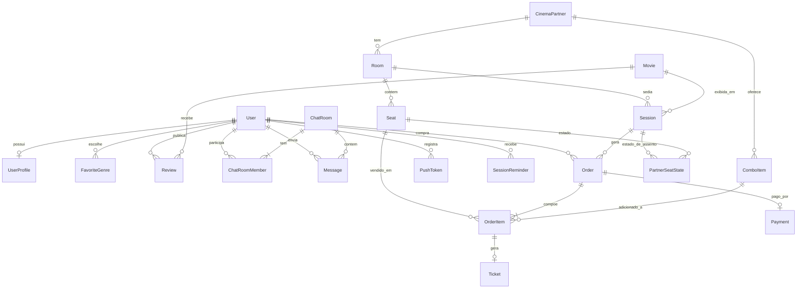
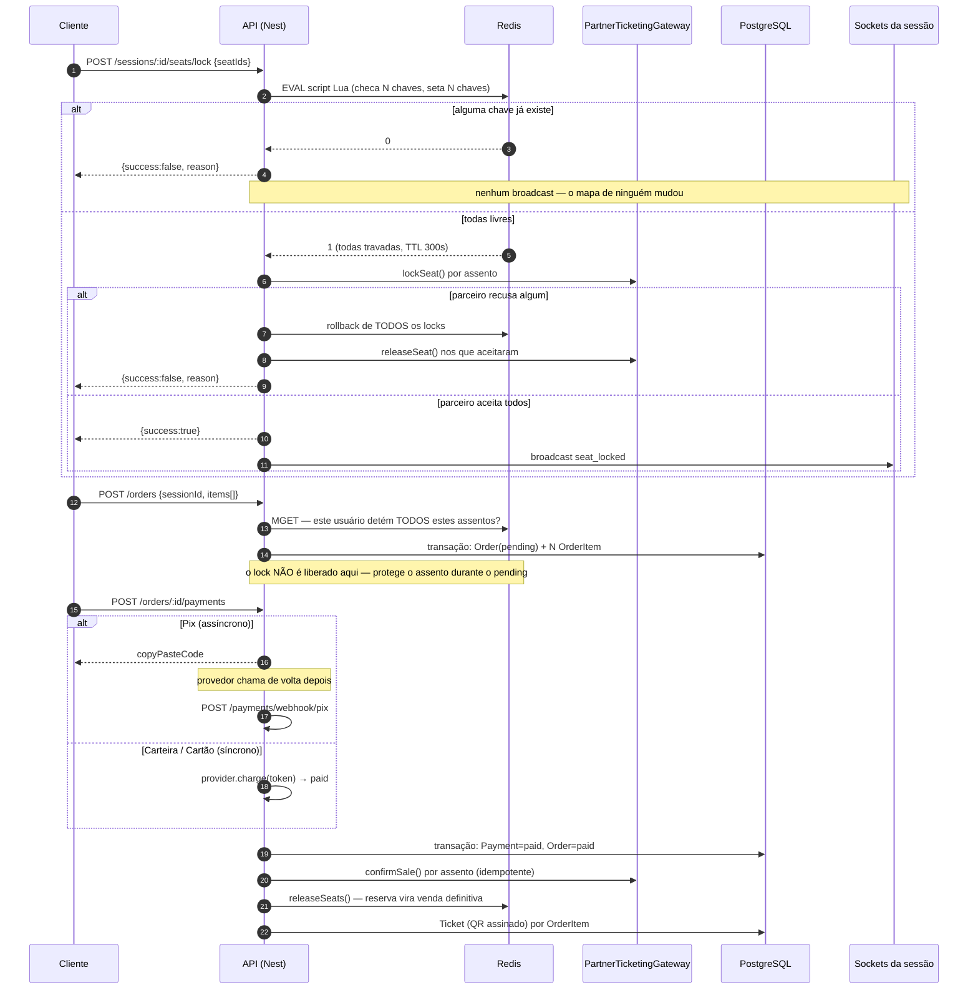
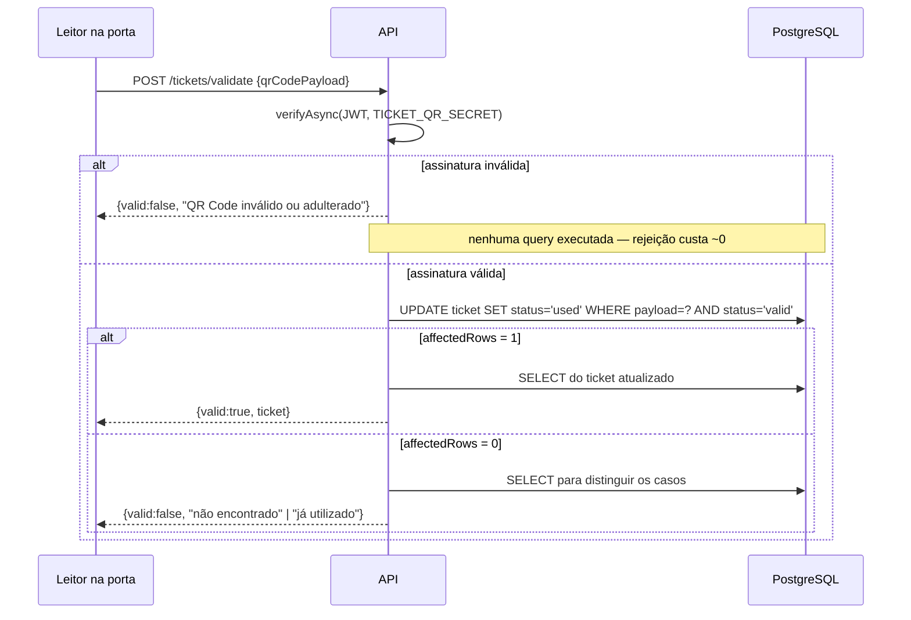
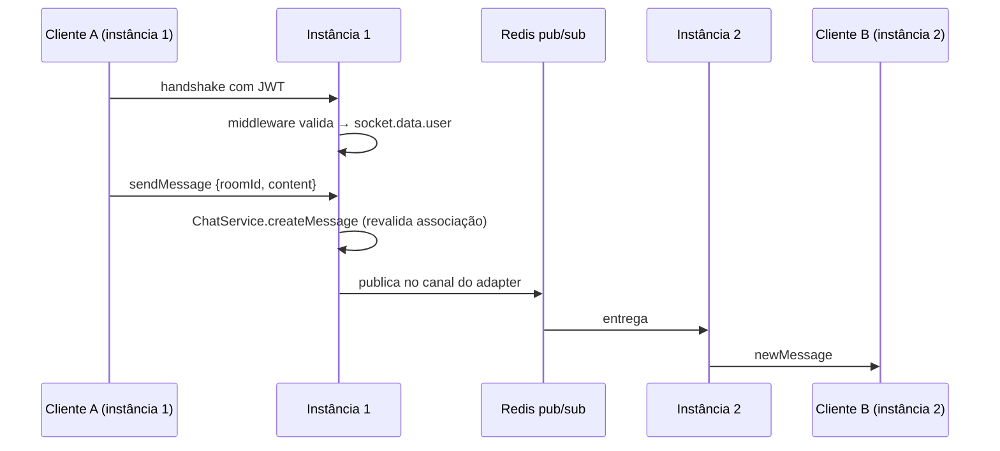

# CineVerse — Dossiê Técnico do Código (Backend)

### Documento de leitura do sistema, orientado à avaliação

| | |
|---|---|
| **Projeto** | CineVerse — backend do MVP |
| **Autor** | Guilherme Lopes Antunes |
| **Data do levantamento** | 29/08/2026 |
| **Repositório analisado** | `Cineverse/backend` (branch `main`) |
| **Natureza** | API REST + WebSocket para aplicativo B2C de cinema (cliente Flutter, fora deste repositório) |

---

## 0. Como usar este documento

**Para quem avalia (corretor / banca).** Este documento descreve o sistema *como ele está no código*, não como foi planejado. Cada afirmação técnica aponta o arquivo onde pode ser conferida. A seção 6 é o catálogo de classes; a seção 12 concentra os pontos onde o trabalho tem profundidade acima do trivial; a seção 15 antecipa perguntas de arguição com as respostas que o código sustenta.

**Para a IA que vai complementar a escrita.** Leia primeiro a seção 17 (*Notas de fidelidade*), que separa o que é **fato verificado no código** do que é **decisão de projeto declarada** e do que é **lacuna assumida**. Não invente números, versões, medições ou nomes de classe: tudo o que este documento afirma foi extraído do repositório em 29/08/2026 e pode ser reconferido nos caminhos citados. Se precisar expandir uma seção, expanda com *interpretação e fundamentação teórica*, não com fatos novos sobre o sistema.

**Relação com os outros documentos do repositório:**

| Arquivo | Papel | Estado |
|---|---|---|
| `docs/DOCUMENTACAO_TCC.md` | Documento de TCC em prosa (metodologia, resultados, referências) | Existe, porém **desatualizado**: foi escrito antes das entregas BE-32 a BE-36 (ingressos, validação de QR e notificações). Ver seção 17.3 |
| `ARQUITETURA_BACKEND.md` | Desenho técnico de origem (pré-implementação, atualizado em pontos) | Referência de intenção |
| `BACKLOG_BACKEND.md` | 48 tasks numeradas BE-01…BE-48, cada uma rastreada a um requisito | Referência de progresso |
| `CLAUDE.md` | Convenções de código e registro de armadilhas encontradas | Referência de convenção |
| **Este arquivo** | Leitura do código como ele está hoje | Atual |

---

## Sumário

1. [Identificação e números do sistema](#1-identificação-e-números-do-sistema)
2. [O que o sistema faz](#2-o-que-o-sistema-faz)
3. [Stack e justificativa de cada escolha](#3-stack-e-justificativa-de-cada-escolha)
4. [Mapa do repositório](#4-mapa-do-repositório)
5. [Arquitetura](#5-arquitetura)
6. [Catálogo de classes importantes](#6-catálogo-de-classes-importantes)
7. [Modelo de dados](#7-modelo-de-dados)
8. [Fluxos críticos](#8-fluxos-críticos)
9. [Superfície de API](#9-superfície-de-api)
10. [Segurança](#10-segurança)
11. [Estratégia e resultados de testes](#11-estratégia-e-resultados-de-testes)
12. [Concorrência: o núcleo técnico do trabalho](#12-concorrência-o-núcleo-técnico-do-trabalho)
13. [Build, CI e configuração](#13-build-ci-e-configuração)
14. [Estado de conclusão, limitações e trabalhos futuros](#14-estado-de-conclusão-limitações-e-trabalhos-futuros)
15. [Perguntas prováveis de banca, com resposta](#15-perguntas-prováveis-de-banca-com-resposta)
16. [Rastreabilidade requisito → código](#16-rastreabilidade-requisito--código)
17. [Notas de fidelidade (para quem for complementar)](#17-notas-de-fidelidade-para-quem-for-complementar)
18. [Glossário](#18-glossário)

---

## 1. Identificação e números do sistema

Todas as métricas abaixo foram medidas no repositório em 29/08/2026.

| Métrica | Valor |
|---|---|
| Arquivos TypeScript de produção (exclui testes e código gerado) | **125** |
| Linhas de código de produção | **5.065** |
| Suítes de teste unitário | **27** (4.079 linhas) |
| Casos de teste unitário | **184**, todos aprovados em **2,77 s** |
| Suítes de teste end-to-end | **5** (659 linhas, 11 casos) |
| Razão linhas de teste : linhas de produção | **≈ 0,94 : 1** |
| Módulos de domínio | **13** |
| Entidades no contrato de dados | **20 modelos** |
| Rotas HTTP | **37** (35 de domínio + `/health` + rota raiz de boilerplate) |
| Namespaces WebSocket | **2** (`/chat`, `/seats`) |
| Filas assíncronas | **2** (`catalog-sync`, `session-reminder`) |
| Tasks do backlog concluídas | **35 de 45 aplicáveis** (3 declaradas fora de escopo) |

**Comando para reconferir os testes:**

```bash
npm test
```

---

## 2. O que o sistema faz

O CineVerse une, num só aplicativo, duas coisas que normalmente vivem separadas: **rede social de cinéfilos** (feed de resenhas com controle de spoiler, chat individual e em grupo) e **compra de ingresso hiperlocalizada** num cinema parceiro (catálogo em cartaz, busca por proximidade, mapa de assentos em tempo real, checkout com combos, pagamento, ingresso com QR Code assinado e validação na porta).

O backend deste repositório entrega toda a lógica de servidor dessas duas frentes. O cliente Flutter não faz parte deste repositório.

**Recorte deliberado do MVP:** um único cinema parceiro piloto. Integração B2B com múltiplas redes, painel de analytics para o parceiro, catraca offline, fidelidade/gamificação e recomendação por IA estão declarados **fora de escopo** — a exclusão do painel B2B foi confirmada explicitamente pelo cliente em 29/08/2026 e está registrada em três documentos do repositório, não é omissão.

---

## 3. Stack e justificativa de cada escolha

| Camada | Tecnologia | Por que esta, e não outra |
|---|---|---|
| Runtime | Node.js 24 + TypeScript 5.7 | Ecossistema com melhor suporte a WebSocket e I/O concorrente; tipagem estática obrigatória para um domínio com dinheiro e concorrência |
| Framework HTTP | **NestJS 11** (sobre Express) | Injeção de dependência nativa, modularidade imposta pelo framework e suporte de primeira classe a WebSocket no mesmo processo. A DI é o que torna possível trocar `MockPartnerGateway` por um gateway real sem tocar em nenhum serviço de domínio |
| Banco transacional | **PostgreSQL** | Transações ACID reais são pré-requisito para venda de ingresso; `UPDATE` condicional com trava de linha é usado como mecanismo de correção (seção 12) |
| ORM | **Prisma 8 ("Prisma Next", release candidate)** | Contrato único (`contract.prisma`) com cliente totalmente tipado, e — decisivo neste projeto — **duas vias de acesso**: a via ORM (`db.orm`) e um SQL builder tipado (`db.sql`). A segunda via foi indispensável (seção 12.3) |
| Estado efêmero | **Redis** (`ioredis`) | Lock de assento com TTL, pub/sub entre instâncias e backend das filas — três usos que exigem armazenamento fora do processo para a aplicação poder escalar horizontalmente |
| Tempo real | **Socket.io 4** + `@socket.io/redis-adapter` | Salas, reconexão e *fallback* prontos; o adapter Redis é o que faz um broadcast emitido na instância A chegar a um cliente conectado na instância B |
| Filas / jobs | **BullMQ 6** | Agendamento recorrente idempotente (`upsertJobScheduler`) e retry com backoff, sobre o Redis que o projeto já tem |
| Autenticação | `@nestjs/jwt` + `bcryptjs` | JWT *stateless* combina com escala horizontal (nenhuma sessão em memória de processo). `bcryptjs` é JavaScript puro — evita compilação de binário nativo no ambiente de desenvolvimento |
| Validação | `class-validator` + `class-transformer` | Contrato de entrada declarado no próprio DTO, aplicado por pipe global |
| Log | `nestjs-pino` (Pino) | Log estruturado em JSON com *request id* propagado por `AsyncLocalStorage` — condição para rastrear um erro reportado pelo cliente até a linha exata |
| Testes | Jest 30 + Supertest + `socket.io-client` | Unitário com dublês; e2e contra PostgreSQL e Redis reais |

**Integração externa real:** TMDB (catálogo de filmes). **Integrações simuladas:** ERP do cinema parceiro, provedor Pix, gateway de cartão, carteiras Apple/Google Pay e FCM — todas atrás de interface, pelos motivos da seção 5.4.

---

## 4. Mapa do repositório

```
backend/
├── src/
│   ├── main.ts                     Bootstrap (a ordem das linhas importa — seção 5.5)
│   ├── app.module.ts               Composição raiz: 13 módulos + guard e filtro globais
│   │
│   ├── common/                     Infraestrutura transversal (não é domínio)
│   │   ├── config/                 jwt.config.ts, ticket-qr.config.ts
│   │   ├── decorators/             @Public(), @CurrentUser()
│   │   ├── filters/                AllExceptionsFilter (formato único de erro)
│   │   ├── guards/                 JwtAuthGuard (global)
│   │   ├── geo/                    haversine.ts (distância entre coordenadas)
│   │   ├── logger/                 pino-options.ts (request id, redação de headers)
│   │   └── prisma/                 is-unique-violation.ts
│   │
│   ├── prisma/                     contract.prisma (fonte), db.ts (cliente), *.d.ts/json (gerados)
│   ├── redis/                      Módulo global de conexão Redis
│   ├── queue/                      Conexão dedicada do BullMQ
│   ├── websocket/                  RedisIoAdapter, middleware de auth, filtro de exceção WS
│   │
│   └── modules/                    13 módulos de domínio
│       ├── auth/                   Cadastro, login, emissão de tokens
│       ├── users/                  Perfil e gêneros favoritos
│       ├── catalog/                Cliente TMDB, job de sync, listagem local
│       ├── sessions/               Parceiros, salas, sessões, combos, busca por proximidade
│       ├── seats/                  Mapa de assentos, lock atômico, gateway WS /seats
│       ├── feed/                   Resenhas, spoiler, compartilhamento
│       ├── chat/                   Salas, mensagens, gateway WS /chat
│       ├── orders/                 Checkout (individual e em grupo)
│       ├── payments/               Pix, carteiras, cartão, liquidação do pedido
│       ├── tickets/                Geração e validação de QR Code assinado
│       ├── notifications/          Push tokens, lembrete de sessão, broadcast
│       ├── partner-integration/    Porta e adaptador do ERP do parceiro
│       └── health/                 Liveness (Postgres + Redis)
│
├── test/                           5 suítes e2e + setup determinístico de env
├── migrations/                     Histórico e snapshots do contrato de dados
├── .github/workflows/ci.yml        Pipeline: lint → build → unit → e2e
├── docs/                           Documentação de TCC
└── ARQUITETURA_BACKEND.md, BACKLOG_BACKEND.md, CLAUDE.md
```

**Convenção de camadas, verificável em qualquer módulo:** `controller` (ou `gateway`) → `service` → acesso a dados. O controller é fino por regra — recebe, delega, devolve. Nenhuma regra de negócio vive em controller ou gateway. É o que permite que **um mesmo serviço sirva simultaneamente a um endpoint REST e a um handler WebSocket sem duplicação** — `SeatLockService` é o exemplo canônico: é chamado por `SeatMapController` (HTTP) e por `SeatsGateway` (WebSocket).

---

## 5. Arquitetura

### 5.1 Visão em camadas

```
┌───────────────────────────────────────────────────────────────┐
│  CLIENTE Flutter (fora deste repositório)                     │
└──────────────┬────────────────────────────┬───────────────────┘
               │ HTTP/REST                  │ WebSocket
┌──────────────▼────────────────────────────▼───────────────────┐
│  CAMADA DE ENTRADA                                            │
│  Controllers REST (17)        │  Gateways WS (2)              │
│  · ValidationPipe global      │  · Auth no handshake,         │
│  · JwtAuthGuard global        │    aplicada a TODO namespace  │
│  · AllExceptionsFilter global │  · WsHttpExceptionFilter      │
└──────────────┬────────────────────────────────────────────────┘
┌──────────────▼────────────────────────────────────────────────┐
│  CAMADA DE SERVIÇO — toda a regra de negócio                  │
│  AuthService · UsersService · CatalogService · FeedService    │
│  ChatService · SessionsService · PartnersService · RoomsSvc   │
│  ComboItemsService · SeatLockService · SeatMapService         │
│  OrdersService · PaymentsService · TicketsService             │
│  SessionReminderService · PushTokensService · PromotionPush   │
└────┬─────────────────┬──────────────────┬─────────────────────┘
     │                 │                  │
┌────▼──────────┐ ┌────▼───────────┐ ┌────▼──────────────────────┐
│ PERSISTÊNCIA  │ │ ESTADO EFÊMERO │ │ PORTAS (interfaces + DI)  │
│ Prisma 8      │ │ Redis          │ │ PartnerTicketingGateway   │
│ PostgreSQL    │ │ · locks (TTL)  │ │ PixProvider               │
│ 20 entidades  │ │ · pub/sub WS   │ │ TokenChargeProvider       │
│               │ │ · filas BullMQ │ │ PushSender                │
└───────────────┘ └────────────────┘ └────────┬──────────────────┘
                                              │ adaptadores
                             ┌────────────────▼──────────────────┐
                             │ MockPartnerGateway · MockPix      │
                             │ MockWallet · MockCardGateway      │
                             │ MockPushSender                    │
                             │ TmdbClient (integração REAL)      │
                             └───────────────────────────────────┘
```

### 5.2 Padrão arquitetural: Ports and Adapters na fronteira externa

Toda dependência externa do sistema está atrás de uma **interface TypeScript** e é injetada por **token de DI** (`Symbol`), nunca por classe concreta:

| Porta (interface) | Token de DI | Adaptador atual | Arquivo |
|---|---|---|---|
| `PartnerTicketingGateway` | `PARTNER_TICKETING_GATEWAY` | `MockPartnerGateway` | `modules/partner-integration/` |
| `PixProvider` | `PIX_PROVIDER` | `MockPixProvider` | `modules/payments/` |
| `TokenChargeProvider` → `WalletProvider` | `WALLET_PROVIDER` | `MockWalletProvider` | `modules/payments/` |
| `TokenChargeProvider` → `CardGatewayProvider` | `CARD_GATEWAY_PROVIDER` | `MockCardGatewayProvider` | `modules/payments/` |
| `PushSender` | `PUSH_SENDER` | `MockPushSender` | `modules/notifications/` |

Consequência concreta e verificável: `PaymentsService` **nunca menciona uma classe de provedor**. Trocar o mock do Pix por Efí, Mercado Pago ou Asaas é registrar outra classe no `PaymentsModule` — nenhum serviço de domínio muda. Isso atende RNF-10 (substituibilidade do parceiro) de forma estrutural, não por intenção documentada.

`WalletProvider` e `CardGatewayProvider` merecem nota: os dois fluxos (carteira e cartão) são **idênticos em forma** — o cliente tokeniza, o backend cobra o token, a confirmação é síncrona. Em vez de duplicar a interface, o projeto extraiu `TokenChargeProvider` como contrato comum e manteve **dois tokens de DI distintos**, porque os provedores reais serão diferentes. `PaymentsService.create` escolhe entre eles com uma linha (`dto.method === 'card' ? cardGatewayProvider : walletProvider`) e o resto do caminho é o mesmo código — não três cópias.

### 5.3 Decisões transversais e suas consequências

| Decisão | Como está implementada | Consequência prática |
|---|---|---|
| **Segurança por padrão** | `JwtAuthGuard` registrado como `APP_GUARD` global em `app.module.ts` | Toda rota nasce protegida. Esquecer de proteger uma rota nova é **impossível**; o erro possível passa a ser o inverso — esquecer o `@Public()` numa rota que devia ser aberta — que falha ruidosamente no primeiro teste |
| **Validação por padrão** | `ValidationPipe` global com `whitelist`, `forbidNonWhitelisted`, `transform` | Campo não declarado no DTO é **rejeitado com 400**, não ignorado. Comprovado ao vivo: enviar `cardNumber` no corpo de pagamento retorna `"property cardNumber should not exist"` |
| **Formato único de erro** | `AllExceptionsFilter` global | Cliente trata um só formato: `{ statusCode, error, message, requestId, timestamp, path }` |
| **Não vazamento de detalhe interno** | Mesmo filtro, distinguindo `HttpException` de qualquer outra exceção | Exceção não prevista devolve apenas `"Internal server error"`; stack trace vai só para o log, correlacionado pelo `requestId` |
| **Aplicação sem estado** | Nenhum estado de sessão em memória de processo | Escala horizontal sem *sticky sessions* (RNF-01/RNF-07) |
| **Versionamento de API** | Prefixo global `/api/v1`, com `/health` deliberadamente **fora** | A probe de infraestrutura não depende da versão da API |
| **Dinheiro em inteiro** | `priceCents`, `totalAmountCents` são `Int` | Nenhum ponto flutuante em valor monetário, em nenhuma tabela |
| **Posse ≠ existência** | Recurso de outro usuário devolve **403**, não 404 | Política declarada: negar acesso sem ocultar a existência. Aplicada em `orders`, `payments`, `chat` |

### 5.4 Por que integrações simuladas — e por que isso não é uma fraqueza

Cinco integrações externas não tinham credencial real disponível durante o desenvolvimento (ERP do parceiro, Pix, cartão, carteiras, FCM). Duas saídas eram possíveis: (a) deixar o fluxo incompleto até haver credencial, ou (b) definir a **interface** que o sistema real vai cumprir e implementar um adaptador simulado atrás dela.

O projeto escolheu (b), e a diferença é arquitetural, não cosmética: o mock não é um `if (ambiente === 'dev')` espalhado pelo serviço — é uma classe que implementa um contrato explícito, registrada por token. O fluxo de negócio inteiro (reserva → pedido → pagamento → liquidação → ingresso → validação) foi exercitado ponta a ponta contra esses adaptadores, com dados reais no PostgreSQL. O que falta para produção é a classe do provedor e a credencial — não o desenho.

Um detalhe revela o rigor da escolha: `MockPixProvider` devolve um "copia e cola" **declaradamente falso**, e o código explica por quê — reproduzir fielmente o formato EMVCo/BR Code (codificação TLV, checksum CRC16) seria fingir com precisão um formato que nenhum banco real vai ler. Um token obviamente falso é mais honesto sobre o que aquilo é.

### 5.5 Bootstrap: `main.ts`, onde a ordem importa

```
1. import 'dotenv/config'      ← PRIMEIRO import do arquivo, sem exceção
2. NestFactory.create(AppModule, { bufferLogs: true })
3. useLogger(Pino) + LoggerErrorInterceptor
4. ValidationPipe global
5. RedisIoAdapter → connectToRedis() → useWebSocketAdapter()
6. enableShutdownHooks()
7. setGlobalPrefix('api/v1', { exclude: ['health'] })
8. listen(PORT ?? 3000)
```

Duas dessas linhas têm ordem obrigatória e ambas estão comentadas no código:

- **Linha 1.** `jwt.config.ts` e `prisma/db.ts` leem `process.env` **no carregamento do módulo**, não dentro de função. Se `.env` ainda não foi lido nesse instante, o valor congela como `undefined` para sempre — e o sintoma aparece só em runtime, como `secretOrPrivateKey must have a value`, nunca como erro de import. Isso já quebrou uma vez ao mover um arquivo de lugar (mudou a ordem de `require`).
- **Linha 5.** O adapter Redis precisa existir **antes** de qualquer `@WebSocketGateway()` subir: `createIOServer()` anexa o adapter que já estiver pronto naquele momento, não espera por um.

### 5.6 Três conexões Redis distintas — e por que não podem ser uma só

Parece redundância; é exigência técnica de cada consumidor.

| Conexão | Uso | Por que não compartilha |
|---|---|---|
| Cliente injetável (token `REDIS`) | Locks de assento, cache | Usa `maxRetriesPerRequest: 3`, apropriado para comandos comuns |
| Conexão do BullMQ (`queue/bullmq.config.ts`) | Filas | BullMQ **exige** `maxRetriesPerRequest: null` por usar comandos bloqueantes; esse valor seria errado para o resto da aplicação |
| Par pub/sub do Socket.io (`websocket/redis-io.adapter.ts`) | Broadcast entre instâncias | O cliente *subscriber* entra no modo `SUBSCRIBE` do Redis enquanto conectado e **não pode** executar comandos comuns |

As três são derivadas da mesma `REDIS_URL` — uma variável de ambiente, três clientes com configurações distintas.

---

## 6. Catálogo de classes importantes

Esta é a seção de referência para leitura do código. Para cada classe: onde está, o que faz, e o que merece atenção de quem avalia.

### 6.1 Roteiro de leitura sugerido (10 arquivos, nesta ordem)

Se o tempo de avaliação for curto, estes dez arquivos contam a história inteira do trabalho:

| # | Arquivo | Por quê |
|---|---|---|
| 1 | `src/main.ts` | Bootstrap e as decisões globais em 40 linhas |
| 2 | `src/app.module.ts` | Composição do sistema inteiro; guard e filtro globais |
| 3 | `src/prisma/contract.prisma` | Modelo de dados completo, com justificativa comentada em cada decisão |
| 4 | `src/modules/seats/seat-lock.service.ts` | **O núcleo técnico**: atomicidade via script Lua |
| 5 | `src/modules/tickets/tickets.service.ts` | Segundo núcleo: QR assinado + `UPDATE` condicional |
| 6 | `src/modules/payments/payments.service.ts` | Orquestração da liquidação, idempotência |
| 7 | `src/modules/partner-integration/partner-ticketing-gateway.interface.ts` | A porta que sustenta RNF-10 |
| 8 | `src/websocket/redis-io.adapter.ts` | Escala horizontal do tempo real, com dois bugs reais documentados |
| 9 | `src/common/guards/jwt-auth.guard.ts` | Segurança por padrão |
| 10 | `test/seat-lock-concurrency.e2e-spec.ts` | A prova empírica de RNF-08 |

### 6.2 Infraestrutura transversal (`src/common`, `src/websocket`, `src/prisma`, `src/redis`, `src/queue`)

| Classe / função | Arquivo | Responsabilidade | Ponto de atenção |
|---|---|---|---|
| `JwtAuthGuard` | `common/guards/jwt-auth.guard.ts` | Guard **global**: extrai `Bearer`, verifica assinatura com o segredo de *access*, popula `request.user` | Respeita `@Public()` via `Reflector`. Distingue token **expirado** de token **inválido** na mensagem — útil ao cliente, sem vazar nada |
| `@Public()` | `common/decorators/public.decorator.ts` | Marca rota/controller como isento do guard global | Usado em exatamente 3 lugares: `/health`, `auth/*`, webhook do Pix |
| `@CurrentUser()` | `common/decorators/current-user.decorator.ts` | Extrai `{ userId, email }` do request | A função `extractCurrentUser` é exportada **separada** do decorator para poder ser testada sem passar pelo pipeline de DI do Nest |
| `AllExceptionsFilter` | `common/filters/all-exceptions.filter.ts` | Formato único de erro; log correlacionado | Separa `HttpException` (mensagem segura, vai ao cliente) de qualquer outra exceção (mensagem genérica ao cliente, detalhe só no log). 5xx loga como `error`, 4xx como `warn` |
| `pinoLoggerOptions` | `common/logger/pino-options.ts` | Log estruturado | Gera/propaga `x-request-id` e **remove** (`redact`) `authorization`, `cookie` e `set-cookie` das linhas de log |
| `isUniqueViolation` | `common/prisma/is-unique-violation.ts` | Reconhece violação de unicidade do Postgres (`sqlState: '23505'`) | Extraída no **terceiro** uso, não no primeiro — evita abstração prematura. Usada em `auth`, `rooms`, `seats`, `catalog`, `partner-integration`, `notifications` |
| `haversineDistanceKm` | `common/geo/haversine.ts` | Distância em linha reta entre coordenadas | Decisão explícita de **não** usar PostGIS enquanto houver poucos parceiros; o comentário registra quando reavaliar |
| `db` | `prisma/db.ts` | Singleton do cliente Prisma 8 | Não é injetável por DI — é import direto. Isso define o padrão de teste (`jest.mock('../../prisma/db', …)`) |
| `PrismaModule` | `prisma/prisma.module.ts` | Módulo global; fecha o pool no shutdown | O `onApplicationShutdown` foi adicionado depois: nenhum teste anterior rodava query real o suficiente para expor o *handle* vazando |
| `RedisModule` | `redis/redis.module.ts` | Cliente Redis global, com log de ciclo de vida | Erro de conexão **apenas loga**, nunca derruba o processo; `retryStrategy` com backoff limitado a 5 s |
| `RedisIoAdapter` | `websocket/redis-io.adapter.ts` | Adapter do Socket.io com pub/sub Redis + auth de handshake | Contém **dois defeitos reais corrigidos** — ver 6.6 |
| `createWsAuthMiddleware` | `websocket/ws-auth.middleware.ts` | Autentica o handshake com o **mesmo** access token do REST | Aceita `handshake.auth.token` (convenção do Socket.io) **ou** header `Authorization` |
| `WsHttpExceptionFilter` | `websocket/ws-http-exception.filter.ts` | Traduz `HttpException` para evento `exception` no socket | Sem ele, `NotFoundException`/`ForbiddenException` chegariam ao cliente como `"Internal server error"` genérico — o filtro padrão do Nest só reconhece `WsException` |

### 6.3 Módulos de identidade e social

| Classe | Arquivo | Responsabilidade | Ponto de atenção |
|---|---|---|---|
| `AuthService` | `modules/auth/auth.service.ts` | Cadastro (bcrypt, 10 rounds) e login (access 15 min + refresh 7 dias) | **Dois segredos distintos** por design. E o login executa `bcrypt.compare` contra um hash-dummy fixo **mesmo quando o e-mail não existe** — sem isso, o tempo de resposta revelaria quais e-mails têm conta. A mensagem devolvida é idêntica nos dois casos |
| `UsersService` | `modules/users/users.service.ts` | Perfil + gêneros favoritos, com semântica *full-replace* | Usa o **SQL builder** para o `DELETE`, não a via ORM — porque `db.orm…where(predicado).delete()` apaga **apenas uma linha** (seção 12.3). Há teste travando essa regressão |
| `FeedService` | `modules/feed/feed.service.ts` | Resenhas, ofuscação de spoiler, metadados de compartilhamento | `obfuscateIfSpoiler` é aplicada **na leitura**: a listagem já chega com `text: null` quando há spoiler. `reveal()` é a única forma de obter o texto. E `share()` reaproveita a mesma função — spoiler não vaza nem pelo compartilhamento, o que seria o furo óbvio |
| `ChatService` | `modules/chat/chat.service.ts` | Salas individuais e em grupo, mensagens, verificação de associação | Sala `individual` faz *get-or-create* pelo par de usuários — dois usuários que conversam de novo não criam sala nova. `assertMember` é chamada **também** por `ChatService.createMessage`, nunca confiando que `joinRoom` foi chamado antes |
| `ChatGateway` | `modules/chat/chat.gateway.ts` | Namespace `/chat`: `joinRoom`, `sendMessage` → broadcast `newMessage` | Faz `socket.join()` de forma idempotente antes de emitir, garantindo que o próprio remetente receba a mensagem mesmo sem ter entrado na sala antes |

### 6.4 Módulos de catálogo e sessão

| Classe | Arquivo | Responsabilidade | Ponto de atenção |
|---|---|---|---|
| `TmdbClient` | `modules/catalog/tmdb/tmdb.client.ts` | Cliente HTTP do TMDB com timeout e retry | Três detalhes: (1) `fetch` nativo com `AbortController` — sem axios; (2) retry com backoff exponencial em timeout, falha de rede e 429/5xx, **nunca em 4xx** (exceto 429), porque isso não se resolve tentando de novo; (3) detecta automaticamente chave v3 (query param) vs. token v4 (header Bearer) |
| `TmdbClient.buildUrl` | idem | Monta a URL | Corrige uma armadilha do próprio `URL` do Node: `new URL('/movie/x', 'https://host/3')` **descarta** o `/3` silenciosamente. Normaliza os dois lados |
| `CatalogSyncService` | `modules/catalog/catalog-sync.service.ts` | Pagina o *now playing* e grava em `Movie` | Não usa `.upsert()` — a via ORM só detecta conflito pela **chave primária**, não por um `@unique` arbitrário como `tmdbId` (seção 12.3). O job **nunca remove** filme que saiu de cartaz, para não quebrar referências de `Session`/histórico |
| `CatalogSyncScheduler` / `Processor` | `modules/catalog/` | Job recorrente BullMQ (6 h por padrão) | `upsertJobScheduler` é idempotente por id — reiniciar a aplicação não duplica agendamento. Um job avulso dispara no boot para o catálogo não ficar vazio até o primeiro intervalo |
| `CatalogService` | `modules/catalog/catalog.service.ts` | `GET /catalog/movies` paginado | **Nunca chama o TMDB.** Serve só a tabela local: uma indisponibilidade do TMDB é invisível para o usuário |
| `PartnersService` | `modules/sessions/partners.service.ts` | CRUD de parceiro + `findNearest` por Haversine | `latitude`/`longitude` são **obrigatórios** — campo que não existia no desenho original, mas sem o qual RF-07 não funciona |
| `RoomsService`, `SeatsService`, `SessionsService`, `ComboItemsService` | `modules/sessions/`, `modules/seats/` | Cadastro da estrutura física e comercial | Padrão consistente: `findOrThrow` do pai antes de criar o filho (`RoomsService.create` chama `PartnersService.findOrThrow`). Não confia só na FK do Postgres, cujo erro viraria 500 genérico. `SeatsService.createMany` cria o lote **em transação**: um código duplicado derruba o lote inteiro, nunca cria parcial |

### 6.5 Módulos de venda — o coração do sistema

| Classe | Arquivo | Responsabilidade | Ponto de atenção |
|---|---|---|---|
| `PartnerTicketingGateway` (interface) | `modules/partner-integration/…interface.ts` | Contrato com o ERP do parceiro | Opera **por assento**, nunca em lote — a atomicidade "N ou nenhum" é responsabilidade do Redis, não desta porta. `lockSeat`/`confirmSale` devolvem `{success, reason?}` em vez de lançar exceção: perder uma disputa por assento é resultado **esperado**, não erro. `confirmSale` é **idempotente por contrato** |
| `MockPartnerGateway` | `modules/partner-integration/mock-partner.gateway.ts` | Máquina de estados `available → locked → sold` sobre `PartnerSeatState` | Estado em **PostgreSQL, não em memória de processo** — memória local quebraria silenciosamente com múltiplas instâncias. Ausência de linha significa `"available"` por convenção. `releaseSeat` num assento vendido é *no-op* deliberado (desfazer venda seria fluxo de estorno) |
| **`SeatLockService`** | `modules/seats/seat-lock.service.ts` | **A garantia real de RNF-08** | Ver seção 12.1. Script Lua para lock atômico de N assentos; compare-and-delete para liberação; `MGET` em chaves específicas — **nunca `KEYS`**, comando que a própria documentação do Redis desaconselha em produção por ser O(keyspace) e bloquear o servidor |
| `SeatMapService` | `modules/seats/seat-map.service.ts` | Modelo de leitura combinado do mapa | Sobrepõe o lock Redis ao status do parceiro: assento com lock aparece `locked` mesmo que o parceiro ainda diga `available` — por segurança, embora no caminho normal os dois já estejam sincronizados |
| `SeatsGateway` | `modules/seats/seats.gateway.ts` | Namespace `/seats` | Distinção deliberada: sucesso é **broadcast** para a sessão inteira; falha de lock vai **só para quem tentou** (`lockRejected`) — ninguém mais teve o mapa alterado. `releaseSeat` só transmite os assentos que o chamador **realmente** detinha |
| `OrdersService` | `modules/orders/orders.service.ts` | Checkout individual **e** em grupo | Exige que **todo** `seatId` esteja com lock Redis **do próprio comprador** (`getSeatIdsHeldBy`) — 409 se faltar algum. Esse mesmo teste serve de validação de existência de graça: um assento que nunca pertenceu à sessão jamais teria sido travado. **O lock não é liberado ao criar o pedido** — continua protegendo o assento durante toda a janela *pending* |
| `OrdersService.validateCombos` | idem | Valida combos | Combo precisa existir **e** pertencer ao mesmo parceiro da sessão — menu de combo é por parceiro; um combo de outro cinema retorna 400 |
| **`PaymentsService`** | `modules/payments/payments.service.ts` | Cria cobrança e liquida o pedido | Dois caminhos de confirmação: **assíncrono** (Pix, via webhook) e **síncrono** (carteira/cartão, o gateway já confirmou). Os dois convergem para `settlePaidOrder` |
| `PaymentsService.settlePaidOrder` | idem | Efeitos colaterais da confirmação | Três ações, todas idempotentes: confirma a venda com o parceiro, **libera o lock Redis** (converte reserva temporária em venda definitiva, sem esperar o TTL) e **gera um `Ticket` por `OrderItem`**. Pagamento `failed` nunca chama este método |
| `TicketsService` | `modules/tickets/tickets.service.ts` | Gera e valida o QR Code | Ver seção 12.2. O payload do QR **é** um JWT HS256 com segredo próprio — não um id sequencial. Validação verifica a **assinatura primeiro**: um código forjado é rejeitado **sem tocar no banco** |

### 6.6 Notificações e observabilidade

| Classe | Arquivo | Responsabilidade | Ponto de atenção |
|---|---|---|---|
| `PushTokensService` | `modules/notifications/push-tokens.service.ts` | Registro de token de dispositivo | A chave única é o **token**, não `(userId, platform)`: um aparelho pode legitimamente trocar de dono (logout de um usuário, login de outro). Reregistrar transfere a posse, nunca duplica linha |
| `SessionReminderService` | `modules/notifications/session-reminder.service.ts` | Lembrete antes da sessão comprada | Roda por **tick de job recorrente**, não por timer agendado na compra — sobrevive a restart/deploy sem timer durável. Deduplicação para **uma notificação por (usuário, sessão)**: quem comprou 3 assentos recebe 1 aviso. A tabela `SessionReminder` (unique composto) é o que impede reenvio no tick seguinte |
| `PromotionPushService` | `modules/notifications/promotion-push.service.ts` | Broadcast de promoção | Reaproveita o mesmo `PushSender` — não duplica a abstração |
| `HealthService` | `modules/health/health.service.ts` | Liveness | 200 se Postgres **e** Redis respondem; 503 com diagnóstico **individualizado** (`database`/`redis`) se algum falhar |

**Os dois defeitos reais corrigidos no `RedisIoAdapter`** — vale ler no arquivo, porque são achados genuínos de integração, não erros de digitação:

1. **`server.use(mw)` só se aplica ao namespace padrão `/`.** Um namespace nomeado criado depois (via `.of('/chat')`, como o Nest faz) nunca via o middleware: `socket.data.user` ficava `undefined`, o handshake não era rejeitado mesmo sem token, e o primeiro acesso a `socket.data.user.userId` estourava `TypeError`. Corrigido escutando `server.on('new_namespace', ns => ns.use(mw))` — o Socket.io emite esse evento de forma síncrona para **todo** namespace, no instante da criação, antes de qualquer cliente conseguir conectar.
2. **`close()` fechava as conexões Redis sem guarda.** O Nest chama `close()` **uma vez por gateway registrado**; com dois gateways compartilhando o adapter, o segundo `.quit()` batia numa conexão já fechada, e o `ioredis` lança em vez de ser *no-op*. Corrigido com uma flag `redisClosed`.

Os dois só apareceram quando o segundo namespace passou a existir — o teste anterior usava apenas o namespace padrão. É um exemplo legítimo de limite de cobertura de teste descoberto por evolução do sistema.

---

## 7. Modelo de dados

### 7.1 As 20 entidades

| Grupo | Entidades |
|---|---|
| Identidade | `User`, `UserProfile`, `FavoriteGenre` |
| Catálogo | `Movie` |
| Estrutura física | `CinemaPartner`, `Room`, `Seat`, `Session`, `ComboItem` |
| Social | `Review`, `ChatRoom`, `ChatRoomMember`, `Message` |
| Venda | `PartnerSeatState`, `Order`, `OrderItem`, `Payment`, `Ticket` |
| Notificação | `PushToken`, `SessionReminder` |

### 7.2 Relações principais



### 7.3 Convenções do modelo, com justificativa

| Convenção | Motivo registrado no próprio contrato |
|---|---|
| **Dinheiro em `Int` (centavos)** | `Session.priceCents`, `ComboItem.priceCents`, `Order.totalAmountCents`. Nenhum ponto flutuante em valor monetário |
| **`String` em vez de `enum`** | `ChatRoom.type`, `Payment.status`, `PartnerSeatState.status`, `Ticket.status`. O suporte a enum deste Prisma em RC não foi validado, e o contrato **já rejeita** coluna de lista escalar. A restrição é aplicada no DTO (`@IsIn`) — decisão conservadora consciente, documentada |
| **Sem coluna de lista escalar** | `String[]` não existe nesta versão. Preferência multivalorada virou tabela própria com unique composto (`FavoriteGenre { userId, genre }`) — o que, aliás, permite consultar "quem gosta do gênero X" sem desempacotar blob |
| **`Ticket.qrCodePayload @unique`** | É simultaneamente o **conteúdo** do QR e a **chave de busca** da validação. Um índice único direto, sem join — é o que sustenta o RNF-12 |
| **`PushToken.token @unique`** | E não `(userId, platform)` — justificado na seção 6.6 |
| **`SessionReminder @@unique([userId, sessionId])`** | A garantia estrutural de "um lembrete por usuário por sessão" |
| **`onDelete: Cascade` em relações de posse** | Apagar usuário leva junto perfil, gêneros, resenhas, mensagens e pedidos |

Gestão do schema: fonte única em `contract.prisma` → `prisma contract emit` gera `contract.json`/`contract.d.ts` (**não editar**) → `prisma db update` em desenvolvimento, `prisma migration plan` + `prisma db migrate` em produção. Banco de produção nunca é alterado manualmente.

---

## 8. Fluxos críticos

### 8.1 Compra sem duplicidade (RF-08/RF-09, RNF-08) — o fluxo principal

O requisito de negócio é curto e severo: **dois usuários não podem comprar o mesmo assento**, nem que cliquem no mesmo milissegundo, nem que estejam falando com instâncias diferentes do servidor.



**Três camadas independentes protegem contra a venda dupla**, e a distinção entre elas é o ponto mais importante do trabalho:

| Camada | Contra o quê protege | Onde vive |
|---|---|---|
| Lock Redis atômico (script Lua) | Concorrência **interna** do app, inclusive entre instâncias diferentes | `SeatLockService` |
| Sincronização com o gateway do parceiro | Venda pelo canal **físico** do parceiro (balcão) | `PartnerTicketingGateway` |
| Verificação de posse antes do pedido | Pedido criado sem reserva prévia, ou com assento reservado por **outro** usuário | `OrdersService` |

### 8.2 Validação de ingresso (RF-14, RNF-12)



Dois pontos de projeto: (1) a resposta é **sempre 200**, nunca exceção — ler um QR ruim na porta é tráfego normal de leitor, não erro de servidor; (2) a assinatura é verificada **antes** de qualquer acesso ao banco, então um ataque de QR forjado em volume não gera carga de banco alguma.

### 8.3 Chat em tempo real, entre instâncias



Sem o adapter Redis, o cliente B **nunca** receberia a mensagem — cada instância manteria suas salas apenas em memória. É exatamente o que `test/websocket.e2e-spec.ts` prova, subindo duas instâncias reais da aplicação.

### 8.4 Sincronização do catálogo (RF-06, RT-02)

Job BullMQ recorrente (6 h) chama o TMDB, pagina os resultados e grava em `Movie`. O endpoint que o usuário consome **lê apenas a tabela local**. Consequência: TMDB fora do ar não afeta nenhuma requisição de usuário — só faz o catálogo envelhecer. Falha no job é logada, o BullMQ tenta de novo, e o último catálogo sincronizado com sucesso continua sendo servido. Medição registrada: **197 filmes** sincronizados contra a API real.

### 8.5 Lembrete de sessão (RF-17)

Job recorrente busca sessões dentro da janela (24 h por padrão), cruza com pedidos `paid`, deduplica por `(userId, sessionId)`, envia push para cada dispositivo do usuário e grava `SessionReminder`. É esse registro — não um flag em memória — que impede o reenvio no tick seguinte. Corrida entre dois ticks é tratada por `isUniqueViolation`.

---

## 9. Superfície de API

### 9.1 Rotas HTTP (37 rotas)

Prefixo `/api/v1` em tudo, exceto `/health`. **Todas autenticadas por padrão**; a coluna "Público" marca as três exceções.

| Método | Rota | Função | Público |
|---|---|---|:---:|
| GET | `/health` | Liveness com diagnóstico de Postgres e Redis | ✔ |
| POST | `/api/v1/auth/register` | Cadastro | ✔ |
| POST | `/api/v1/auth/login` | Login → access + refresh token | ✔ |
| GET/PUT | `/api/v1/users/me/profile` | Perfil e gêneros favoritos (PUT é *full-replace*) | |
| GET | `/api/v1/catalog/movies` | Catálogo paginado (só da tabela local) | |
| POST/GET | `/api/v1/partners` | Cinemas parceiros | |
| POST/GET | `/api/v1/partners/:partnerId/rooms` | Salas do parceiro | |
| POST/GET | `/api/v1/partners/:partnerId/combos` | Menu de combos do parceiro | |
| POST/GET | `/api/v1/rooms/:roomId/seats` | Assentos da sala (criação em lote transacional) | |
| POST/GET | `/api/v1/sessions` | Sessões de exibição | |
| GET | `/api/v1/sessions/nearby?lat=&lng=` | Sessões futuras do parceiro mais próximo | |
| GET | `/api/v1/sessions/:sessionId/seats/map` | Mapa de assentos (snapshot inicial) | |
| POST | `/api/v1/sessions/:sessionId/seats/lock` | **Reserva atômica tudo-ou-nada de N assentos** | |
| POST | `/api/v1/sessions/:sessionId/seats/release` | Liberação (só do que o chamador detém) | |
| POST | `/api/v1/sessions/:sessionId/seats/:seatId/box-office-sale` | Simulação de venda no balcão físico | |
| POST/GET | `/api/v1/reviews` | Publicação e feed paginado | |
| GET | `/api/v1/reviews/:id/reveal` | Revelação de resenha com spoiler | |
| GET | `/api/v1/reviews/:id/share` | Metadados para compartilhamento externo | |
| POST/GET | `/api/v1/chat/rooms` | Criação e listagem de salas | |
| GET | `/api/v1/chat/rooms/:roomId/messages` | Histórico paginado | |
| POST/GET | `/api/v1/orders` | Checkout (1 ou N assentos) e listagem | |
| GET | `/api/v1/orders/:id` | Detalhe com verificação de posse | |
| POST/GET | `/api/v1/orders/:orderId/payments` | Cobrança e listagem de pagamentos | |
| POST | `/api/v1/payments/webhook/pix` | Webhook do provedor Pix | ✔ |
| POST | `/api/v1/tickets/validate` | **Validação do QR Code** | |
| POST | `/api/v1/push-tokens` | Registro de token de dispositivo | |
| POST | `/api/v1/notifications/broadcast` | Push de promoção para todos os dispositivos | |

### 9.2 Eventos WebSocket

Autenticação de handshake comum a todo namespace: o **mesmo** access token JWT do REST, via `handshake.auth.token` ou header `Authorization: Bearer`.

**Namespace `/chat`**

| Direção | Evento | Payload | Comportamento |
|---|---|---|---|
| C → S | `joinRoom` | `{ roomId }` | Entra na sala após verificar associação |
| C → S | `sendMessage` | `{ roomId, content }` | Persiste e transmite |
| S → C | `newMessage` | mensagem persistida | Difundido à sala, **entre instâncias** |
| S → C | `exception` | `{ status, message }` | Erro de domínio com mensagem real (via `WsHttpExceptionFilter`) |

**Namespace `/seats`**

| Direção | Evento | Payload | Comportamento |
|---|---|---|---|
| C → S | `joinSession` | `{ sessionId }` | Passa a observar a sessão |
| C → S | `lockSeat` / `releaseSeat` | `{ sessionId, seatId }` | Reserva / liberação de um assento |
| S → C | `seat_locked` | `{ sessionId, seatId }` | Difundido à sessão inteira |
| S → C | `seat_released` | `{ sessionId, seatId }` | Difundido **apenas se o estado realmente mudou** |
| S → C | `seat_sold` | `{ sessionId, seatId }` | Difundido à sessão inteira |
| S → **apenas quem tentou** | `lockRejected` | `{ sessionId, seatId, reason }` | Perder a disputa não altera o mapa de mais ninguém |

Essa última distinção é deliberada e vale destacar em defesa: o sistema **nunca anuncia uma mudança que não aconteceu**. `releaseSeats` retorna quais assentos foram de fato liberados, e só esses são transmitidos.

---

## 10. Segurança

### 10.1 Controles implementados

| Controle | Implementação |
|---|---|
| Armazenamento de senha | bcrypt, 10 rounds. `passwordHash` **nunca** é selecionado em consulta que alimente resposta HTTP — toda leitura de `User` encadeia `.select(...)` explícito |
| Autenticação | JWT access (15 min) + refresh (7 dias), com **segredos criptográficos distintos**: vazar um não permite forjar o outro |
| Autorização por padrão | Guard global; exceções explícitas e auditáveis (3 no sistema inteiro) |
| Proteção contra enumeração de contas | `bcrypt.compare` contra hash-dummy mesmo sem conta + mensagem idêntica: nem o tempo nem o texto revelam quais e-mails existem |
| Limite de senha | Máx. 72 bytes no DTO — acima disso o bcrypt trunca silenciosamente |
| Validação de entrada | Pipe global **rejeita** (não ignora) campo não declarado |
| Não vazamento de detalhe interno | Exceção não prevista → `"Internal server error"`; detalhe só no log correlacionado |
| Redação de log | `authorization`, `cookie` e `set-cookie` removidos das linhas de log |
| Autorização por posse | Pedido/pagamento/chat de outro usuário → **403** |
| Autenticação do canal em tempo real | Middleware no servidor Socket.io, aplicado a todo namespace via `new_namespace` |
| Integridade do ingresso | QR é JWT HS256 com **segredo próprio** (`TICKET_QR_SECRET`), separado dos de auth. Um id sequencial seria forjável por incremento |
| Segredos | Exclusivamente por variável de ambiente; `.env` fora do versionamento, `.env.example` documenta cada variável com instrução de geração (`openssl rand -hex 32`) |

### 10.2 Lacunas conhecidas — declaradas, não descobertas

Registrar a lacuna com o motivo é parte da qualidade do trabalho:

- **Webhook de pagamento sem verificação de assinatura.** O endpoint é público por natureza (quem chama é o provedor, não um usuário logado). Um provedor real assinaria a requisição; sem provedor homologado, fabricar uma verificação falsa não agregaria nada — e daria falsa sensação de segurança.
- **Sem RBAC.** Qualquer usuário autenticado cadastra parceiro, sala, assento e sessão, valida ingresso e dispara broadcast. **Não existe papel administrativo no sistema** — a simplificação está registrada em todos os pontos afetados, com a nota de revisitar quando o papel existir.
- **Sem rate limiting.** Previsto na arquitetura para autenticação, não implementado.
- **Sem controle de acesso por sessão no mapa de assentos.** Qualquer autenticado observa qualquer sessão — consistente com o resto do app, que não tem controle de acesso por sessão em lugar nenhum.
- **Refresh token sem rotação nem revogação.** Emitido, mas não há endpoint de renovação nem *blocklist*.

---

## 11. Estratégia e resultados de testes

### 11.1 Pirâmide adotada

| Nível | Quantidade | Escopo | Dependências |
|---|---|---|---|
| Unitário | **27 suítes, 184 casos** | Regra de negócio isolada por serviço | Banco, Redis, bcrypt e HTTP substituídos por dublês |
| End-to-end | **5 suítes, 11 casos** | Aplicação real completa | PostgreSQL e Redis **reais** |
| Validação manual | — | Fluxos multiusuário simultâneos | Dois clientes reais, tokens reais |

**Execução em 29/08/2026:** `27 suítes, 184 testes, 184 aprovados, 0 falhas, 2,77 s`.

### 11.2 O que cada suíte e2e prova, e por que precisa ser e2e

| Suíte | O que verifica | Por que mock não serviria |
|---|---|---|
| `seat-lock-concurrency.e2e-spec.ts` | **20 tentativas concorrentes** (`Promise.all`) de travar o mesmo assento contra Redis real: exatamente **1** vence, 19 falham com motivo. Verifica também que um perdedor consegue travar depois da liberação | Atomicidade sob concorrência não se prova com dublê — um mock serializa as chamadas e "passaria" mesmo com código errado |
| `ticket-validation-concurrency.e2e-spec.ts` | 20 validações concorrentes do mesmo QR ainda válido: exatamente **1** sucesso. Precedidas de checkout e pagamento **reais** ponta a ponta, não de um `Ticket` fabricado à mão | Só o travamento de linha de um Postgres real serializa `UPDATE` concorrente |
| `websocket.e2e-spec.ts` | Sobe **duas instâncias reais** e confirma que um broadcast emitido na instância A chega a um cliente da instância B, exclusivamente via Redis. Rejeita handshake sem token e com token inválido | O adapter Redis existe precisamente para o cenário multi-instância |
| `group-order.e2e-spec.ts` | Checkout de **3 assentos** (um com combo) → 1 `Order`, 3 `OrderItem`, total exato → pagamento Pix → webhook → **3 `Ticket` reais**, todos `valid`, com payload distinto e verificável | Integridade transacional entre cinco tabelas exige banco real |
| `app.e2e-spec.ts` | Guard global: rota sem token → 401; com token válido → 200 | Prova que o guard está **de fato registrado globalmente**, não apenas testado isolado |

### 11.3 Amostra do que a suíte unitária cobre

Emissão e expiração de token; rejeição idêntica para e-mail inexistente e senha errada; paginação (offset, `totalPages` nunca zero); ofuscação e revelação de spoiler; **não vazamento de spoiler pelo compartilhamento**; verificação de associação antes de persistir mensagem de chat; retry do TMDB em 503/500/timeout/falha de rede e **ausência de retry em 401**; autenticação TMDB nos dois formatos de chave; máquina de estados completa do gateway do parceiro, incluindo idempotência de `confirmSale`; **rollback total do lock quando o parceiro recusa um assento do grupo**; recusa de combo de parceiro diferente; idempotência do webhook Pix; transferência de posse de push token; deduplicação de lembrete por `(usuário, sessão)`; regressão do `DELETE` multi-linha em `UsersService`.

### 11.4 Medições de validação manual registradas

| Cenário | Medido | Critério do requisito |
|---|---|---|
| Mensagem de chat entre dois clientes reais | **~17 ms** | < 2.000 ms (RF-05) |
| Venda no balcão propagada a dois clientes conectados | **~28 ms** | Tempo real (RF-10/RD-02) |
| Validação de QR na porta | **~5–10 ms** | < 500 ms (RNF-12) |
| Sincronização com a API real do TMDB | **197 filmes** | Catálogo reflete filmes em cartaz (RF-06) |
| 20 tentativas concorrentes no mesmo assento | **1 venda** | Zero duplicidade (RNF-08) |

---

## 12. Concorrência: o núcleo técnico do trabalho

Esta seção concentra o que distingue o trabalho de um CRUD bem organizado. São três achados independentes, todos com correção implementada e prova empírica.

### 12.1 Lock atômico de N assentos com script Lua

**O problema.** Reservar 3 assentos "ou todos ou nenhum". A solução ingênua — um `SET NX EX` por assento — tem uma janela de corrida entre a primeira e a segunda chave: outro usuário pode ganhar o assento 2 depois de você ter travado o assento 1, e o sistema fica com um lock parcial de um grupo que falhou.

**A solução.** Um script Lua executado por `EVAL`. O Redis executa scripts Lua como **uma única operação atômica** — nenhum outro comando intercala no meio. O script checa todas as N chaves e, só se todas estiverem livres, seta todas:

```lua
for i, key in ipairs(KEYS) do
  if redis.call('EXISTS', key) == 1 then
    return 0
  end
end
for i, key in ipairs(KEYS) do
  redis.call('SET', key, ARGV[1], 'EX', ARGV[2])
end
return 1
```

**A liberação também é um script**, e por um motivo sutil: um `DEL` puro liberaria o lock de **outra pessoa**. Se o TTL do chamador expirou e outro usuário já reocupou o assento, o `DEL` roubaria o lock desse terceiro. O script faz *compare-and-delete* — só apaga se o valor for o `userId` esperado:

```lua
if redis.call('GET', KEYS[1]) == ARGV[1] then
  return redis.call('DEL', KEYS[1])
else
  return 0
end
```

**A prova.** `test/seat-lock-concurrency.e2e-spec.ts`: 20 chamadas verdadeiramente concorrentes contra Redis real, exatamente uma vence.

### 12.2 Ingresso não forjável

O payload do QR **é** um JWT HS256 assinado com segredo dedicado. A alternativa óbvia — um id sequencial ou UUID no banco — falharia por dois motivos: um id sequencial é forjável por incremento, e qualquer id exige uma consulta ao banco só para descobrir que é lixo. Com JWT, a verificação de assinatura acontece **antes de qualquer query**: um código adulterado é rejeitado a custo zero de banco. Testado ao vivo: payload adulterado é rejeitado com `"invalid signature"` sem tocar no PostgreSQL.

### 12.3 Duas limitações reais da via ORM, descobertas em execução

Este é o achado mais interessante do trabalho do ponto de vista de engenharia, porque foi descoberto **empiricamente contra banco real**, não lido em documentação — e porque a segunda ocorrência é **intermitente**, o tipo de defeito mais difícil de encontrar.

**Achado 1 — `delete()` por predicado apaga apenas uma linha.**
`db.orm.<Model>.where(predicado).delete()` remove **uma** linha mesmo quando o predicado casa com várias (verificado: sobraram 2 de 3). Nenhuma documentação avisa. Afetava a semântica *full-replace* do perfil de usuário. **Correção:** usar o SQL builder (`db.sql`), com teste travando a regressão.

**Achado 2 — `update()` condicional não é garantia confiável de atomicidade sob carga concorrente.**
A validação de ingresso dependia de `db.orm.public.Ticket.where({qrCodePayload, status:'valid'}).update(...)` como **única** garantia de que apenas um scan do mesmo QR vence. Funcionava perfeitamente isolado — em teste unitário e em e2e chamando só esse endpoint.

Quando uma entrega posterior registrou um **segundo worker BullMQ** rodando no mesmo processo, o mesmíssimo teste passou a deixar **2 de 20** chamadas concorrentes vencerem a corrida, de forma consistente — não uma vez, toda vez.

O diagnóstico foi feito por **bisseção**, e o resultado é preciso:

| Cenário | Reproduz? |
|---|---|
| Endpoint isolado, 20 chamadas concorrentes | Não |
| Worker BullMQ registrado, sem job disparando | Não |
| Ruído concorrente de queries não relacionadas (`Promise.all`) | Não |
| **Scheduler registrado E disparando um job real durante a corrida** | **Sim, sempre** |

Ou seja: não é "mais tráfego no banco" — é especificamente um job rodando de verdade durante a corrida que expõe o comportamento. **A causa raiz não foi identificada**, e o documento registra isso honestamente em vez de inventar uma explicação. A correção foi trocar pela via do SQL builder, que devolve `affectedRows` e cujo `UPDATE … WHERE …` é um único round trip: retestado sob carga idêntica, **1 de 20 sempre**, estável em múltiplas rodadas.

**A regra que ficou registrada em `CLAUDE.md` para o projeto:** qualquer código que precise de *check-then-update* condicional como garantia real de corrida deve usar o SQL builder desde o início. A via ORM só é segura quando a corrida já está resolvida em outra camada.

**Por que isso conta a favor do trabalho, e não contra:** um defeito intermitente que só aparece sob interação entre dois subsistemas é exatamente a classe de bug que passa despercebida em produção por meses. Ele foi encontrado porque havia teste de concorrência real, isolado por método sistemático, corrigido, e a correção foi verificada sob a mesma carga que expôs o problema. É o ciclo completo de engenharia de defeito.

---

## 13. Build, CI e configuração

### 13.1 Pipeline

`.github/workflows/ci.yml`, a cada push nas branches principais e em todo pull request, sobre **Node.js 24**:

```
npm ci → lint:check → build → test (unitário) → test:e2e
```

O job provisiona um **serviço Redis real** (`redis:7` com healthcheck), porque a suíte de WebSocket exercita o adapter de verdade. O `lint:check` roda sem `--fix` de propósito: no CI, lint deve **falhar**, não corrigir silenciosamente.

### 13.2 Comandos

```bash
npm run dev            # servidor em watch mode
npm run build          # build de produção
npm test               # 184 testes unitários
npm run test:e2e       # 11 testes end-to-end (exige Postgres e Redis)
npm run lint:check     # o que o CI roda

npx prisma contract emit   # regenera artefatos após editar contract.prisma
npx prisma db update       # aplica o contrato ao banco local
npx prisma db verify       # confere se banco e contrato batem
```

### 13.3 Variáveis de ambiente

Documentadas uma a uma em `.env.example`, com instrução de geração para os segredos:

`DATABASE_URL` · `REDIS_URL` · `JWT_ACCESS_SECRET` · `JWT_ACCESS_EXPIRES_IN` · `JWT_REFRESH_SECRET` · `JWT_REFRESH_EXPIRES_IN` · `TICKET_QR_SECRET` · `TMDB_API_KEY` · `TMDB_BASE_URL` · `TMDB_TIMEOUT_MS` · `TMDB_MAX_RETRIES` · `TMDB_RETRY_BASE_MS` · `TMDB_SYNC_INTERVAL_MS` · `SHARE_BASE_URL` · `SEAT_LOCK_TTL_SECONDS` · `SESSION_REMINDER_HOURS_BEFORE` · `SESSION_REMINDER_INTERVAL_MS`

Detalhe de disciplina: os testes **não dependem de `.env`**. `test/jest.setup.ts` define padrões determinísticos com `??=` — o CI não tem `.env`, e um valor local real ainda prevalece quando existe.

### 13.4 Observação de dívida técnica assumida

O `Dockerfile` está em `node:18-alpine`, desatualizado em relação ao Node 24 usado em desenvolvimento e no CI. Está registrado como pendência em `CLAUDE.md` — é dívida conhecida, não descuido.

---

## 14. Estado de conclusão, limitações e trabalhos futuros

### 14.1 Progresso

| Fase | Escopo | Estado |
|---|---|---|
| 0 — Fundação | Setup, banco, Redis, CI, erros e log | ✅ 5/5 |
| 1 — Identidade | Cadastro, login, guard, perfil | ✅ 4/4 |
| 2 — Catálogo | TMDB, sync, listagem, busca hiperlocal | ✅ 5/5 |
| 3 — Social | Feed, spoiler, compartilhamento, chat | ✅ 5/5 |
| 4 — Assentos e compra | Gateway do parceiro, mapa, lock, checkout, combos | ✅ 7/7 |
| 5 — Pagamentos | Pix, carteiras, cartão, webhook | ✅ 3/4 (BE-31 é validação regulatória, não código) |
| 6 — Ingressos | QR assinado, validação | ✅ 2/2 |
| 7 — Notificações | Push token, lembrete, broadcast | ✅ 3/3 |
| 8 — Painel B2B | — | ⛔ **Fora de escopo** (decisão do cliente, 29/08/2026) |
| 9 — Não funcionais | Carga, monitoramento, homologação, documentação da porta | ⬜ 0/5 |
| 10 — Validação final | Aceite ponta a ponta com clientes teste | ⬜ 0/4 |

**Todo o fluxo funcional do MVP está implementado e verificado.** O que resta é validação em escala (teste de carga com k6/Artillery), monitoramento além do liveness básico, e gates formais com o parceiro — atividades que dependem de ambiente e de terceiros, não de código.

### 14.2 Limitações do estado atual

1. Nenhum provedor externo real está integrado (parceiro, Pix, cartão, carteira, FCM) — todos atrás de interface, com adaptador simulado.
2. Sem RBAC: operações administrativas estão abertas a qualquer autenticado.
3. Um `Payment` por `Order`; não há fluxo de nova tentativa, expiração de cobrança ou estorno.
4. Refresh token emitido mas sem endpoint de renovação, rotação ou revogação.
5. Sem rate limiting.
6. Sem endpoint de leitura de ingressos ("meus ingressos") — o backlog pede geração e validação, não listagem.
7. Busca de proximidade em memória (Haversine em JS), não índice geoespacial — adequado para um parceiro, a reavaliar com muitos.
8. Sem teste de carga executado — é a Fase 9, em aberto.

### 14.3 Trabalhos futuros priorizados

| Prioridade | Item | Justificativa |
|---|---|---|
| Alta | Substituir os cinco adaptadores simulados por integrações reais | Único bloqueio para produção; o desenho já está pronto |
| Alta | Teste de carga (RNF-01/07/08) | Comprovar em escala o que já foi comprovado em concorrência pontual |
| Alta | RBAC com papéis (admin, funcionário do parceiro) | Fecha a maior lacuna de segurança |
| Média | Rotação e revogação de refresh token; rate limiting | Endurecimento de autenticação |
| Média | Monitoramento além do liveness (BE-42) | Observabilidade de produção |
| Média | Fluxo de cancelamento/estorno | Completa o ciclo de vida do pedido |
| Baixa | PostGIS quando o número de parceiros crescer | Gatilho já registrado no código |

---

## 15. Perguntas prováveis de banca, com resposta

Respostas curtas, todas sustentadas pelo código.

**"Por que NestJS e não Express puro?"**
Pela injeção de dependência. Ela não é conveniência — é o que torna as cinco integrações externas substituíveis por token de DI sem alterar nenhum serviço de domínio. Em Express puro, esse desacoplamento seria construído à mão e provavelmente vazaria.

**"Os mocks não invalidam o trabalho?"**
Não, porque não são condicionais espalhados pelo código: são adaptadores de interfaces explícitas, registrados por token. O fluxo de negócio foi exercitado ponta a ponta com dados reais no PostgreSQL. O que falta para produção é a classe do provedor e a credencial, não o desenho. Além disso, a única integração externa disponível — TMDB — **é real**, com retry, timeout e dois formatos de autenticação.

**"Como você garante que dois usuários não compram o mesmo assento?"**
Três camadas independentes: lock Redis atômico via script Lua (concorrência interna, inclusive entre instâncias), sincronização com o gateway do parceiro (venda no balcão físico) e verificação de posse do lock antes de criar o pedido. A garantia é provada, não afirmada: 20 chamadas concorrentes reais, exatamente uma vence (`seat-lock-concurrency.e2e-spec.ts`).

**"Por que um script Lua e não `SET NX`?"**
Porque `SET NX` por assento deixa janela de corrida entre a chave 1 e a chave 2, resultando em lock parcial. O Redis executa script Lua como operação atômica única — é a única forma de "N assentos ou nenhum" ser verdade.

**"E se o Redis cair?"**
A conexão tem reconexão automática com backoff, e erro de conexão apenas loga, nunca derruba o processo. Enquanto o Redis estiver fora, novas reservas falham — que é o comportamento correto: melhor recusar uma reserva do que vender o mesmo assento duas vezes. O `/health` reporta o Redis como `error` individualmente.

**"O QR não pode ser forjado?"**
Não sem o segredo. O payload é um JWT HS256 com segredo dedicado (`TICKET_QR_SECRET`, separado dos de autenticação). Um id sequencial seria forjável por incremento. A assinatura é verificada antes de qualquer query — código adulterado é rejeitado sem tocar no banco.

**"E se alguém tirar print do QR e duas pessoas apresentarem na porta?"**
Exatamente uma validação vence. É `UPDATE … WHERE payload = ? AND status = 'valid'` com `affectedRows`, provado por 20 validações concorrentes contra Postgres real (`ticket-validation-concurrency.e2e-spec.ts`).

**"Como o sistema escala horizontalmente?"**
A aplicação é *stateless*: nenhum estado de sessão em memória de processo. Locks e cache no Redis, dados no Postgres, e o adapter Redis do Socket.io faz um broadcast na instância A chegar a um cliente da instância B — comprovado subindo duas instâncias reais no teste e2e.

**"Você trata dados sensíveis de cartão?"**
Não, e não há como: **não existe campo de número de cartão, validade ou CVV em nenhum DTO do sistema**. O cliente tokeniza (SDK da carteira ou do gateway) e o backend recebe apenas um token opaco. Testado ao vivo: enviar `cardNumber` no corpo retorna 400 com `"property cardNumber should not exist"` — o pipe global rejeita, não ignora.

**"Por que 403 e não 404 em recurso de outro usuário?"**
É política declarada: negar acesso sem ocultar existência. A escolha oposta (404) esconde a existência, mas confunde diagnóstico. O importante é que a política é consistente em todo o sistema, não escolhida caso a caso.

**"Qual foi o problema mais difícil?"**
Um defeito **intermitente**: a validação de ingresso deixava 2 de 20 chamadas concorrentes vencerem em vez de 1, mas **só** quando um job em segundo plano rodava de verdade no mesmo processo. Foi isolado por bisseção sistemática, a causa raiz não foi identificada — e isso está registrado honestamente — e a correção (trocar a via ORM pelo SQL builder) foi verificada sob a mesma carga que expôs o problema. Seção 12.3.

**"O que falta para ir a produção?"**
Cinco integrações reais no lugar dos adaptadores simulados, teste de carga, RBAC e monitoramento. Nada disso exige rearquitetura — as interfaces e os pontos de extensão já existem.

---

## 16. Rastreabilidade requisito → código

Estado **atualizado** em 29/08/2026 (a matriz equivalente em `docs/DOCUMENTACAO_TCC.md` § 4.1 está defasada — ver 17.3).

| Requisito | Descrição | Onde está implementado | Estado |
|---|---|---|---|
| RF-01 | Cadastro e autenticação | `modules/auth` | ✅ |
| RF-02 | Perfil e preferências de gênero | `modules/users` | ✅ |
| RF-03 | Publicação de resenhas | `modules/feed` | ✅ |
| RF-04 | Marcação e ofuscação de spoiler | `FeedService.obfuscateIfSpoiler`, `/reviews/:id/reveal` | ✅ |
| RF-05 | Chat em tempo real | `modules/chat` + namespace `/chat` | ✅ (~17 ms medidos) |
| RF-06 | Catálogo em cartaz | `modules/catalog` (job + endpoint local) | ✅ (197 filmes) |
| RF-07 | Busca hiperlocal de sessões | `GET /sessions/nearby` (Haversine) | ✅ |
| RF-08 | Checkout individual em até 3 passos | `lock` → `POST /orders` → `POST /payments` | ✅ |
| RF-09 | Compra em grupo | Mesmo endpoint, N `OrderItem` por `Order` | ✅ (provado em `group-order.e2e-spec.ts`) |
| RF-10 | Mapa de assentos em tempo real | `modules/seats` + namespace `/seats` | ✅ (~28 ms medidos) |
| RF-11 | Pagamento Pix e carteiras | `PixProvider`, `WalletProvider` | ✅ (simulado atrás de interface) |
| RF-12 | Pagamento com cartão | `CardGatewayProvider` | ✅ (simulado atrás de interface) |
| RF-13 | Geração de QR Code | `TicketsService.generateForOrderItem` | ✅ |
| RF-14 | Validação de QR Code | `POST /tickets/validate` | ✅ |
| RF-15 | Combos | `ComboItem`, combo **por assento** | ✅ |
| RF-16 | Compartilhamento externo | `GET /reviews/:id/share` | ✅ |
| RF-17 | Notificações push | `modules/notifications` (token, lembrete, broadcast) | ✅ (FCM simulado) |
| RNF-01 / RNF-07 | Escalabilidade horizontal | Stateless + Redis + adapter Socket.io | ✅ estrutural; ⬜ teste de carga pendente |
| RNF-02 / RNF-10 | Substituibilidade do parceiro | `PartnerTicketingGateway` + token de DI | ✅ |
| RNF-04 | Monitoramento | `GET /health` básico | ◐ parcial |
| RNF-06 | Payload reduzido | Paginação em toda listagem; imagens por URL da CDN, sem proxy | ✅ |
| RNF-08 | Zero duplicidade de venda | `SeatLockService` (Lua) | ✅ **provado** (20 → 1) |
| RNF-12 | Validação de ingresso sob 500 ms | `TicketsService.validate` | ✅ (~5–10 ms) |
| RD-02 | Sincronização do mapa | Eventos `seat_locked`/`seat_released`/`seat_sold` | ✅ |
| RD-03 | Conformidade Pix | Delegada ao provedor homologado | ⬜ bloqueada por terceiro |
| RT-02 | Uso da API do TMDB | `TmdbClient` | ✅ **integração real** |
| RF-18…21, RN-02, RN-06, RT-04, CU-03 | Painel B2B, push segmentado | — | ⛔ fora de escopo (cliente, 29/08/2026) |

---

## 17. Notas de fidelidade (para quem for complementar)

### 17.1 O que é fato verificado no código

Tudo na seção 1 (métricas), seção 6 (classes e arquivos), seção 7 (modelo de dados), seção 9 (rotas e eventos) e seção 11.1/11.2 (contagem e conteúdo de teste) foi extraído do repositório em 29/08/2026 por leitura direta e execução da suíte. Podem ser reconferidos.

### 17.2 O que é medição registrada, não reproduzida agora

As medições de latência da seção 11.4 (~17 ms de chat, ~28 ms de propagação de venda, ~5–10 ms de validação, 197 filmes) vêm de validação manual documentada durante o desenvolvimento. São **medições únicas de validação funcional**, não *benchmarks* com metodologia estatística. Ao escrever o texto do TCC, descreva-as como tal — "medição de validação funcional" — e não como resultado de teste de desempenho. O teste de carga formal é a Fase 9, ainda em aberto, e afirmar o contrário seria falso.

### 17.3 O que está desatualizado em `docs/DOCUMENTACAO_TCC.md`

Aquele documento foi escrito antes das entregas BE-32 a BE-36. Ao reaproveitá-lo, **corrija**:

- § 4.1: RF-12, RF-13, RF-14, RF-17 e RNF-12 estão marcados "**Não implementado**" — os cinco **estão implementados**. Use a matriz da seção 16 deste documento.
- § 10.1: a tabela de rotas não inclui `/tickets/validate`, `/push-tokens` nem `/notifications/broadcast`. São 37 rotas, não 35.
- § 12.1/12.2: os números de teste envelheceram (162 casos / 23 suítes → **184 casos / 27 suítes**; razão teste:produção ≈ **0,94:1**).
- § 7.1 e § 8: o diagrama de camadas e a contagem de entidades não incluem os módulos `tickets` e `notifications` (são **20 modelos**, 13 módulos de domínio).
- § 15: não menciona o achado do `update()` condicional sob carga concorrente (seção 12.3 deste documento) — que é, tecnicamente, o achado mais forte do trabalho.

### 17.4 Vocabulário a manter consistente

Use os termos exatos do código, não sinônimos: **lock** (não "trava"/"bloqueio" alternados), **assento** (não "poltrona"), **sessão de exibição** (não "sessão de usuário" — o sistema não tem sessão de usuário, é JWT *stateless*), **parceiro** (não "cinema" genérico), **porta/adaptador** ao falar das interfaces. Evite chamar `MockPartnerGateway` de "simulador" no texto formal — é um **adaptador de teste que implementa a porta**, e essa precisão é o argumento.

### 17.5 O que não afirmar

- Não afirme que o sistema "está em produção" ou "foi testado com usuários reais" — não foi; a Fase 10 está aberta.
- Não afirme conformidade regulatória do Pix — está explicitamente delegada a um provedor homologado (RD-03/BE-31), e nenhum foi contratado.
- Não afirme cobertura de testes em porcentagem — o projeto mede **quantidade de casos e proporção de linhas**, não cobertura instrumentada.
- Não descreva as integrações simuladas como "integrações" sem qualificar.

---

## 18. Glossário

| Termo | Significado neste projeto |
|---|---|
| **Adapter / adaptador** | Implementação concreta de uma porta. Ex.: `MockPartnerGateway` implementa `PartnerTicketingGateway` |
| **Porta (port)** | Interface que define o contrato com um sistema externo, sem citar tecnologia |
| **DTO** | Objeto de transferência de dados; declara e valida a forma da entrada de uma rota |
| **Guard** | Componente do Nest que decide se uma requisição pode prosseguir; aqui, verificação de JWT |
| **Idempotência** | Propriedade de uma operação que pode ser repetida sem efeito adicional — essencial para webhook de pagamento, que pode ser reentregue |
| **Lock (de assento)** | Reserva temporária com expiração automática (TTL) no Redis, que impede outro usuário de reservar o mesmo assento |
| **Namespace (WebSocket)** | Canal lógico do Socket.io. Este sistema tem `/chat` e `/seats` |
| **Script Lua (Redis)** | Sequência de comandos executada atomicamente pelo Redis, sem intercalação de outros comandos |
| **Stateless** | Servidor que não guarda estado de sessão em memória — condição para escalar horizontalmente |
| **TTL** | *Time to live*: prazo após o qual uma chave do Redis expira sozinha |
| **Webhook** | Chamada HTTP feita **pelo provedor externo para o sistema**, avisando de um evento (aqui, confirmação de pagamento Pix) |
| **BullMQ** | Biblioteca de filas e jobs sobre Redis |
| **Haversine** | Fórmula de distância em linha reta entre duas coordenadas geográficas sobre a esfera terrestre |
